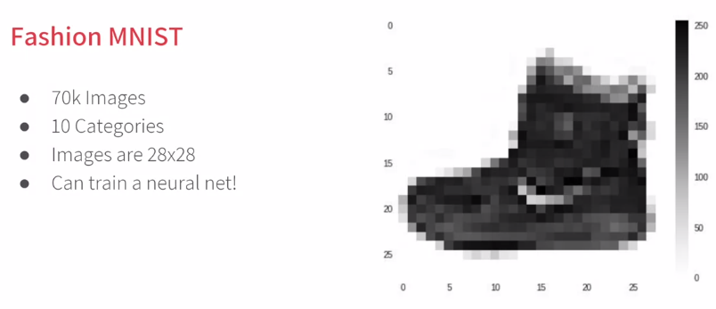

# Introduction to Computer Vision

這次我們想用 week 1 學到的簡單模型，看能不能訓練辨識圖片

用到的資料集是 [Fashion MNIST](https://github.com/zalandoresearch/fashion-mnist)

# Writing code to load training data

# Coding a Computer Vision Neural Network

