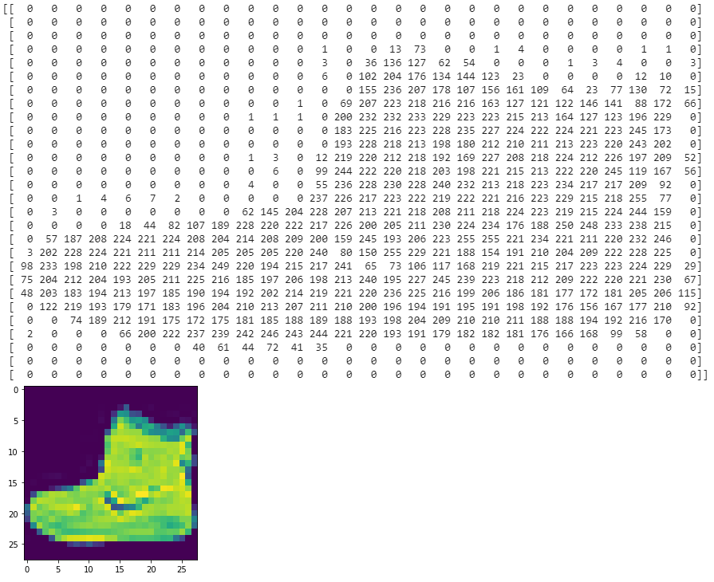
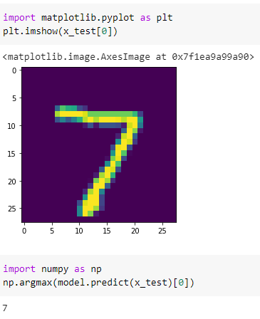

# Introduction to Computer Vision

這次我們想用 week 1 學到的簡單模型，看能不能訓練辨識圖片

用到的資料集是 [Fashion MNIST](https://github.com/zalandoresearch/fashion-mnist)


# Writing code to load training data

我們可以很簡單從 tensorflow 內建的 API 來導入流行服飾分類的 dataset (Fashion MNIST)

``` py
from tensorflow import keras

dataset = keras.datasets.fashion_mnist
(x_train, y_train), (x_test, y_test) = dataset.load_data()
```

* x 的部分會是 28*28 的圖片輸入
* y 的部分是圖片對應的 label (0 到 9)

``` py
import numpy as np
np.set_printoptions(linewidth=200)
print(x_train[0])

import matplotlib.pyplot as plt
plt.imshow(x_train[0])
```



## Normalizing

在網路中，輸入最好介於 0-1 之間，這個處理稱為標準化 (normalize)

``` py
train_x = train_x / 255.0
test_x = test_x / 255.0
```

# Coding a Computer Vision Neural Network


接著是模型的部分:

* **Flatten**: 我們將每個圖片 (28*28) 的 input 先壓扁成一維向量
* 輸出 10 個結果，分別顯示每種類別的預測機率

中間的 hidden layer 共有 128 個 neurons

* 這 128 個 hidden units 可以想像成變數 (x1, x2, x3, ..., x128)
* 會有一些權重 (w0, w1, w2, ..., w128) 來跟這 128 變數相乘
* 最後得到預測的 9 (of 10)

> 在 week 1 要猜出的 `2x-1` 預測中，其中的 `2` 就可以想像成權重

``` py
import tensorflow as tf
from tensorflow import keras

model = keras.Sequential([
    keras.layers.Flatten(input_shape=(28, 28)),
    keras.layers.Dense(128, activation=tf.nn.relu),
    keras.layers.Dense(10, activation=tf.nn.softmax)
])

model.compile(optimizer='adam',
              loss='sparse_categorical_crossentropy', 
              metrics=['accuracy'])

model.fit(x_train, y_train, epochs=5)
model.evaluate(x_test, y_test)

# ...
# Epoch 5/5
# 60000/60000 [==============================] - 2s 39us/sample - loss: 0.2941 - accuracy: 0.8913
# 10000/10000 [==============================] - 0s 32us/sample - loss: 0.3588 - accuracy: 0.8704
```

# Using Callbacks to control training

我們可以透過 callback 控制 training 在完成特定任務，還沒結束所有 epochs 就結束

``` py
class myCallback(tf.keras.callbacks.Callback):
  def on_epoch_end(self, epoch, logs={}):
    if(logs.get('loss')<0.4):
      print("\nReached 60% accuracy so cancelling training!")
      self.model.stop_training = True
```

只要定義好 callback 類，就可以簡單創建並加到 `model.fit()` 當中，裡面的 `on_epoch_end()` 會在每個 epoch 的結束才呼叫

``` py
callbacks = myCallback()

model.compile(optimizer='adam', loss='sparse_categorical_crossentropy')
model.fit(training_images, training_labels, epochs=5, callbacks=[callbacks])

# Epoch 2/5
# 1871/1875 [============================>.] - ETA: 0s - loss: 0.3588
# Reached 60% accuracy so cancelling training!
# 1875/1875 [==============================] - 3s 1ms/step - loss: 0.3590
# <tensorflow.python.keras.callbacks.History at 0x7f61f019b400>
```

# Exercise

在 exercise 2 當中，我們要學習預測辨識手寫數字 0 到 9，使用的是 MNIST 這個 dataset

試著在實作中只要達到 accuracy = 99% 就暫停所有 epochs

1. 要在 10 epochs 前就結束
2. Accuracy 達到 99% 時要 print 出 "Reached 99% accuracy so cancelling training!"



[Exercise 2 的解答在這裡](exercise2.ipynb)