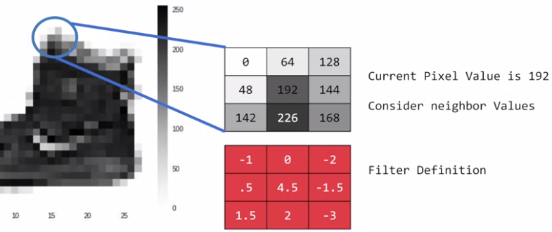
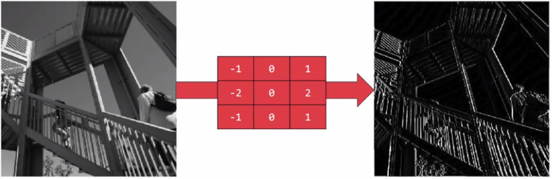
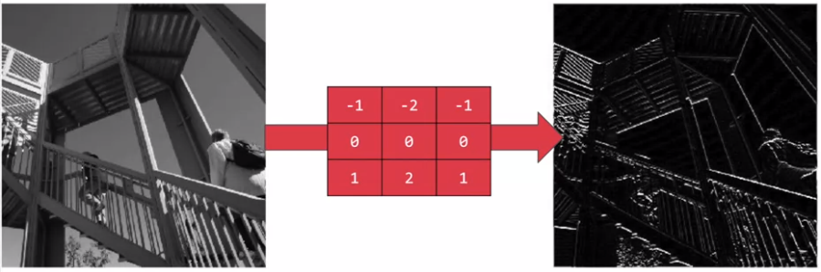
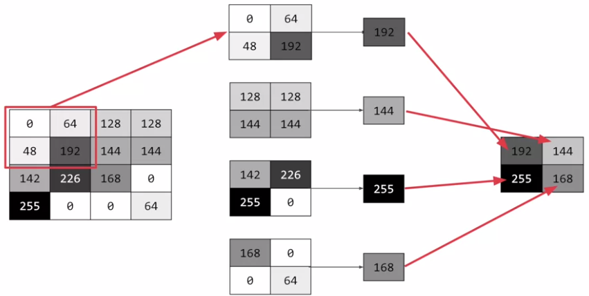

# Enhancing Vision with Convolutional Neural Networks

在 week 2 是使用圖片中的每個 pixels 作為特徵來訓練，但其實可以用 CNN 取到更好更大的特徵 (服裝的樣式、大小、顏色、形狀等)

## What are convolutions and pooling?

卷積 (convolution) 可以從圖片的大量 pixel 中壓縮出重要特徵



Filter 會走遍整張圖片，改變整張圖的樣貌，例如上面的卷積中，原本為 192 的 pixel 經過卷積後就變成

$$
\begin{aligned}
& (-1 \times 0) + (0 \times 64) + (-2 \times 128) + \\
& (0.5 \times 48) + (4.5 \times 192) + (-1.5 \times 144) + \\
& (1.5 \times 42) + (2 \times 226) + (-3 \times 168)
\end{aligned}
$$

如此一來，就可以根據 filter 來擷取出這張圖的特徵 (例如垂直、水平特徵)





最後再和池化 (pooling) 結合，池化是一種壓縮圖片的方式



上面是一個 max pooling 的作法，讓抓取的特徵更加突出，也能縮小圖片

## Implementing convolutional layers

Convolution 在 Tensorflow 中可以用 `Conv2D` 和 `MaxPooling2D` 這兩個 layers class 來實現

我們在原本直接訓練 28*28 個 pixels 的 model 中加上 Convolutional layers

``` python
import tensorflow as tf
mnist = tf.keras.datasets.fashion_mnist

# Split Data
(training_images, training_labels), (test_images, test_labels) = mnist.load_data()
training_images=training_images.reshape(60000, 28, 28, 1)
training_images=training_images / 255.0
test_images = test_images.reshape(10000, 28, 28, 1)
test_images=test_images/255.0

# Build Model
model = tf.keras.models.Sequential([
    tf.keras.layers.Conv2D(64, (3, 3), activation='relu', input_shape=(28, 28, 1)),
    tf.keras.layers.MaxPooling2D(2, 2),
    tf.keras.layers.Conv2D(64, (3, 3), activation='relu'),
    tf.keras.layers.MaxPooling2D(2, 2),
    tf.keras.layers.Flatten(),
    tf.keras.layers.Dense(128, activation='relu'),
    tf.keras.layers.Dense(10, activation='softmax')
])

# Train & Evaluation
model.compile(optimizer='adam', loss='sparse_categorical_crossentropy', metrics=['accuracy'])
model.summary()
model.fit(training_images, training_labels, epochs=5)
test_loss = model.evaluate(test_images, test_labels)
```

得到的結果比 week 2 還要好一些些 !

```
...
...
Epoch 5/5
1875/1875 [==============================] - 11s 6ms/step - loss: 0.1905 - accuracy: 0.9287
313/313 [==============================] - 1s 4ms/step - loss: 0.2645 - accuracy: 0.9069
```

### Explanation

#### Split Data

在資料部分多了一個步驟，將圖片 reshape 成 (28, 28, 1)，其中的 1 代表灰階

#### Build Model

`tf.keras.layers.Conv2D()` 的四個參數分別為:

1. **filter 數量** (64 個)
2. **filter 大小** (3*3)
3. **activation function** (relu)
4. **input data 的形狀** (28, 28, 1)

`tf.keras.layers.MaxPooling2D()` 的兩個參數為:

1. Pooling 的 x 大小
2. Pooling 的 y 大小

第二次的 `Conv2D` 會對前面 `MaxPooling2D` 的結果繼續進行卷積

更進階和詳細的技巧請查看: https://www.youtube.com/playlist?list=PLkDaE6sCZn6Gl29AoE31iwdVwSG-KnDzF

#### Train & Evaluation

我們可以用 `model.summary()` 來查看整個圖片進入模型後的旅程

```
_________________________________________________________________
Layer (type)                 Output Shape              Param #   
=================================================================
conv2d (Conv2D)              (None, 26, 26, 64)        640       
_________________________________________________________________
max_pooling2d (MaxPooling2D) (None, 13, 13, 64)        0         
_________________________________________________________________
conv2d_1 (Conv2D)            (None, 11, 11, 64)        36928     
_________________________________________________________________
max_pooling2d_1 (MaxPooling2 (None, 5, 5, 64)          0         
_________________________________________________________________
flatten (Flatten)            (None, 1600)              0         
_________________________________________________________________
dense (Dense)                (None, 128)               204928    
_________________________________________________________________
dense_1 (Dense)              (None, 10)                1290      
=================================================================
Total params: 243,786
Trainable params: 243,786
Non-trainable params: 0
```

1. 在做完第一個 `conv2D` 之後，因為上下左右邊界都被切一個 pixel 所以變成 26*26
2. 經過 `MaxPooling2D` 後，縮小一倍變成 13*13
3. 第二個 `conv2D` 後變成 11*11
4. 第二個 `MaxPooling2D` 後變成 5*5

## Improving the FASHION classifier with convolutions

我們可以載入上面 model 中的每一個 layer，並把每一個 layer 做為獨立的 **activation model**

如此一來就可以看到每一個 layer 當下的 output 結果

``` python
import matplotlib.pyplot as plt
f, axarr = plt.subplots(3,4)

CONVOLUTION_NUMBER = 0  # 觀看 64 個 filter 中的第 1 個結果

from tensorflow.keras import models
layer_outputs = [layer.output for layer in model.layers]
activation_model = tf.keras.models.Model(inputs = model.input, outputs = layer_outputs)

for x in range(0,4):
    f1 = activation_model.predict(test_images[FIRST_IMAGE].reshape(1, 28, 28, 1))[x]
    axarr[0,x].imshow(f1[0, : , :, CONVOLUTION_NUMBER], cmap='inferno')
    axarr[0,x].grid(False)
    f2 = activation_model.predict(test_images[SECOND_IMAGE].reshape(1, 28, 28, 1))[x]
    axarr[1,x].imshow(f2[0, : , :, CONVOLUTION_NUMBER], cmap='inferno')
    axarr[1,x].grid(False)
    f3 = activation_model.predict(test_images[THIRD_IMAGE].reshape(1, 28, 28, 1))[x]
    axarr[2,x].imshow(f3[0, : , :, CONVOLUTION_NUMBER], cmap='inferno')
    axarr[2,x].grid(False)
```

可以看到在第一個 conv, pool 和第二個 conv, pool 的四個結果，圖片大小的改變可以從 axes 看出來


> * **更多的 filter 資訊:**
> * https://lodev.org/cgtutor/filtering.html

# Exercise

在 week 3 的 exercise 中:

1. 要把 Fashion MNIST 提升到 accuracy 超過 99.8%
2. 只能用一個 `Conv2D` 和一個 `MaxPooling2D`
3. 可以訓練至多 20 個 epochs
4. 必須要寫 callback 在超過 99.8 的時候就停止，並輸出 `"Reached 99.8% accuracy so cancelling training!"`

[Exercise 3 的解答在這裡](exercise3.ipynb)