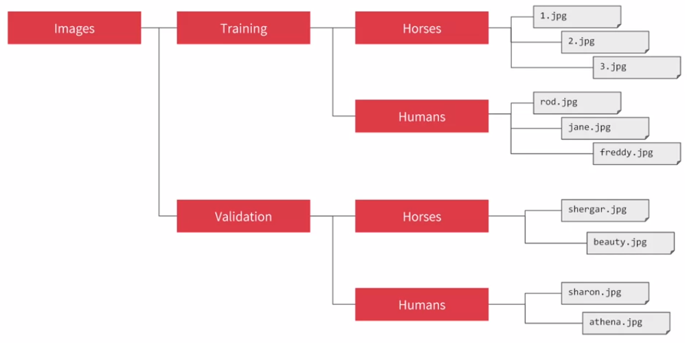
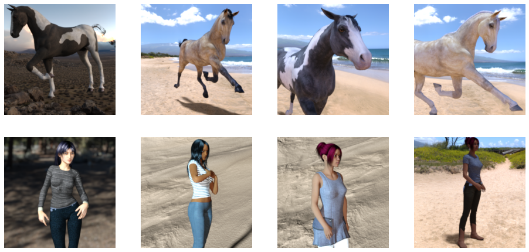
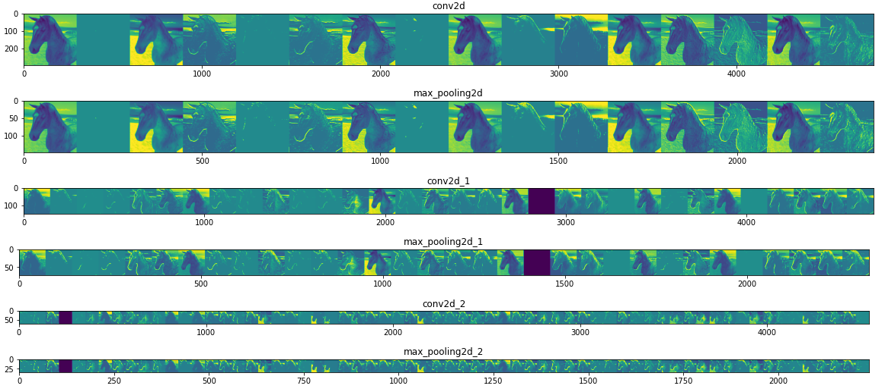

# Using Real-world Images

有了 CNN 基礎後，我們可以試著應用到真實世界的圖片 (顏色、大小更多樣，更複雜)

> * Tensorflow 用於辨識農作物 (Cassava plant) 是否存在疾病
> * https://www.youtube.com/watch?v=NlpS-DhayQA

## Understanding ImageDataGenerator

現實的 data 不像 MNIST 有固定的格式，而 Features, Patterns 可以存在圖片的認一個角落，或有多個一起出現

我們可以用 tensorflow 內建的 `ImageDataGenerator` 來幫助 label 圖片



例如可以把圖片以上面的方式，儲存在你的 file system 中，剩下的就是 `ImageDataGenerator` 的工作了

### Example

先從 filesystem 抓到馬跟人類的圖片

``` python
# Directory with our training horse pictures
train_horse_dir = os.path.join('/tmp/horse-or-human/horses')

# Directory with our training human pictures
train_human_dir = os.path.join('/tmp/horse-or-human/humans')

train_horse_names = os.listdir(train_horse_dir)
train_human_names = os.listdir(train_human_dir)
print('total training horse images:', len(os.listdir(train_horse_dir))) # 500
print('total training human images:', len(os.listdir(train_human_dir))) # 527
```

展示一下馬和人類的圖片

``` python
%matplotlib inline
import matplotlib.pyplot as plt
import matplotlib.image as mpimg

# Parameters for our graph; we'll output images in a 4x4 configuration
nrows = 4
ncols = 4

fig = plt.gcf()
fig.set_size_inches(ncols * 4, nrows * 4)

next_horse_pix = [os.path.join(train_horse_dir, fname) 
                for fname in train_horse_names[-4:]]
next_human_pix = [os.path.join(train_human_dir, fname) 
                for fname in train_human_names[-4:]]

for i, img_path in enumerate(next_horse_pix+next_human_pix):
    # Set up subplot; subplot indices start at 1
    sp = plt.subplot(nrows, ncols, i + 1)

    # Don't show axes (or gridlines)
    sp.axis('Off')

    img = mpimg.imread(img_path)
    plt.imshow(img)

plt.show()
```



來用 `ImageDataGenerator` 載入這些訓練資料

``` python
from tensorflow.keras.preprocessing.image import ImageDataGenerator

train_datagen = ImageDataGenerator(rescale=1/255)

train_generator = train_datagen.flow_from_directory(
    '/tmp/horse-or-human/',
    target_size=(300, 300),
    batch_size=128,
    class_mode='binary'
)
```

1. 可以在創建 `ImageDataGenerator` 時使用 rescale 來 normalize data
2. 在 `ImageDataGenerator.flow_from_directory()` 裡面
   1. 第一個參數為 training data 的資料夾路徑
   2. 第二個參數決定圖片可以被 resize 的大小
   3. 第三個參數決定待會訓練的 batch size
   4. 第四個參數決定 classify 的方式 (這邊是 binary)

## Defining a ConvNet to use complex images

Tensorflow 可以將這些 generator 視為 stream 一一讀入來訓練

所以下一步是建立一個 ConvNet 來處理、訓練這些 data

``` python
model = tf.keras.models.Sequential([
    tf.keras.layers.Conv2D(16, (3,3), activation='relu', input_shape=(300, 300, 3)),
    tf.keras.layers.MaxPooling2D(2, 2),
    tf.keras.layers.Conv2D(32, (3,3), activation='relu'),
    tf.keras.layers.MaxPooling2D(2,2),
    tf.keras.layers.Conv2D(64, (3,3), activation='relu'),
    tf.keras.layers.MaxPooling2D(2,2),
    tf.keras.layers.Flatten(),
    tf.keras.layers.Dense(512, activation='relu'),
    tf.keras.layers.Dense(1, activation='sigmoid')
])

model.summary()
```

這邊使用了三層的 Conv+Pool layers，因為圖片是彩色圖片，所以 3 代表的是每個 pixel 共要 3 bytes 來分別表達 R, G, B channels (24-bit color)

另外最後一層 Dense 變為 `1 neuron`，且 activation 變為 `sigmoid`，原因是這個任務為 binary classification。這會比 (2, softmax) 還要更有效率

> * closer to 0 for horses
> * closer to 1 for humans
> * 了解更多 binary classification: https://www.youtube.com/watch?v=eqEc66RFY0I

整個 `model.summary()` 結果如下:

```
Model: "sequential"
_________________________________________________________________
Layer (type)                 Output Shape              Param #   
=================================================================
conv2d (Conv2D)              (None, 298, 298, 16)      448       
_________________________________________________________________
max_pooling2d (MaxPooling2D) (None, 149, 149, 16)      0         
_________________________________________________________________
conv2d_1 (Conv2D)            (None, 147, 147, 32)      4640      
_________________________________________________________________
max_pooling2d_1 (MaxPooling2 (None, 73, 73, 32)        0         
_________________________________________________________________
conv2d_2 (Conv2D)            (None, 71, 71, 64)        18496     
_________________________________________________________________
max_pooling2d_2 (MaxPooling2 (None, 35, 35, 64)        0         
_________________________________________________________________
flatten (Flatten)            (None, 78400)             0         
_________________________________________________________________
dense (Dense)                (None, 512)               40141312  
_________________________________________________________________
dense_1 (Dense)              (None, 1)                 513       
=================================================================
Total params: 40,165,409
Trainable params: 40,165,409
Non-trainable params: 0
_________________________________________________________________
```

## Training the ConvNet with fit_generator (deprecated)

我們可以開始針對設計好的 `model` 和裝好資料的 `ImageDataGenerator` 進行訓練了

``` python
from tensorflow.keras.optimizers import RMSprop

model.compile(loss='binary_crossentropy',
              optimizer=RMSprop(lr=0.001),
              metrics=['accuracy'])
```

1. 這邊改用 RMSprop 來取代 Adam (https://youtu.be/zLRB4oupj6g)
2. Loss function 改用 binary_crossentropy 來計算

在 `model.fit()` 時載入 generator 即可，`model.fit_generator()` 已經不推薦使用

``` python
model.fit(
    train_generator,
    steps_per_epoch=8,
    epochs=15,
    verbose=1
)

# ...
# Epoch 15/15
# 8/8 [==============================] - 6s 700ms/step - loss: 0.0017 - accuracy: 1.0000
```

1. `steps_per_epoch = 8`
   1. 因為 training data 共有 1024 且 batch size 設為 128
   2. 所以一個 epoch 共要 8 步才可以把 data 走過一遍
2. `verbose=1`
   1. Verbosity mode. 
   2. 0 = silent, 1 = progress bar.

## Adding Automatic Validation to Test Accuracy

載入一些不會被用於訓練的 data，可以在每個 epoch 查看當前訓練效果

``` python
# total validation horse images: 128
validation_horse_dir = os.path.join('/tmp/validation-horse-or-human/horses')

# total validation human images: 128
validation_human_dir = os.path.join('/tmp/validation-horse-or-human/humans')
```

對 validation data 也製作一個 `ImageDataGenerator`

``` python
from tensorflow.keras.preprocessing.image import ImageDataGenerator

validation_datagen = ImageDataGenerator(rescale=1/255)

validation_generator = validation_datagen.flow_from_directory(
    '/tmp/validation-horse-or-human/',
    target_size=(300, 300),
    batch_size=32,
    class_mode='binary'
)
```

稍微修改一下 `model.fit()` 讓他也吃進 `validation_generator`

``` python
history = model.fit(
    train_generator,
    steps_per_epoch=8,
    validation_data=validation_generator,
    validation_steps=8,
    epochs=15,
    verbose=1
)

# ...
# Epoch 15/15
# 8/8 [==============================] - 8s 1s/step - loss: 0.0752 - accuracy: 0.9707 - val_loss: 1.4156 - val_accuracy: 0.8281
```

## Visualizing Intermediate Representations

我們可以用 week 3 的方式，來解析每一層的每個 filter 的產出結果

以下將展示隨機一張圖片，進到我們 conv+pool+conv+pool+conv+pool 的過程

``` python
import numpy as np
import random
from tensorflow.keras.preprocessing.image import img_to_array, load_img

horse_img_files = [os.path.join(train_horse_dir, f) for f in train_horse_names]
human_img_files = [os.path.join(train_human_dir, f) for f in train_human_names]
img_path = random.choice(horse_img_files + human_img_files)

layer_names = [layer.name for layer in model.layers]
successive_outputs = [layer.output for layer in model.layers]
visualization_model = tf.keras.models.Model(inputs = model.input, outputs = successive_outputs)

img = load_img(img_path, target_size=(300, 300))  # this is a PIL image
x = img_to_array(img)  # Numpy array with shape (150, 150, 3)
x = x.reshape((1,) + x.shape)  # Numpy array with shape (1, 150, 150, 3)
x /= 255

successive_feature_maps = visualization_model.predict(x)

for layer_name, feature_map in zip(layer_names, successive_feature_maps):
    # Just do this for the conv / maxpool layers, not the fully-connected layers
    if len(feature_map.shape) == 4:

        # number of features in feature map
        n_features = feature_map.shape[-1]

        # The feature map has shape (1, size, size, n_features)
        size = feature_map.shape[1]

        # We will tile our images in this matrix
        display_grid = np.zeros((size, size * n_features))

        for i in range(n_features):   
            # Postprocess the feature to make it visually palatable
            x = feature_map[0, :, :, i]
            x -= x.mean()
            x /= x.std()
            x *= 64
            x += 128
            x = np.clip(x, 0, 255).astype('uint8')     
            # We'll tile each filter into this big horizontal grid
            display_grid[:, i * size : (i + 1) * size] = x
        
        # Display the grid
        scale = 20. / n_features
        plt.figure(figsize=(scale * n_features, scale))
        plt.title(layer_name)
        plt.grid(False)
        plt.imshow(display_grid, aspect='auto', cmap='viridis')
```



## Real World Prediction

現在可以將訓練好的 model 拿來預測隨便一張馬或人類的圖片，看答案是否正確

``` python
import numpy as np
from google.colab import files
from keras.preprocessing import image

uploaded = files.upload()

for fn in uploaded.keys():
 
  # predicting images
  path = '/content/' + fn
  img = image.load_img(path, target_size=(300, 300))
  x = image.img_to_array(img)
  x = np.expand_dims(x, axis=0)

  images = np.vstack([x])
  classes = model.predict(images, batch_size=10)
  print(classes[0])
  if classes[0]>0.5:
    print(fn + " is a human")
  else:
    print(fn + " is a horse")
```

輸出結果:

```
human_img.jfif(image/jpeg) - 4638 bytes, last modified: 2020/6/30 - 100% done
Saving human_img.jfif to human_img (1).jfif
[1.]
human_img.jfif is a human
```

> * Full Code Resource
> * https://github.com/lmoroney/dlaicourse/blob/master/Course%201%20-%20Part%208%20-%20Lesson%203%20-%20Notebook.ipynb

# Exercise

在 week 4 的 exercise 中:

1. 有 80 張圖片要分類為 **"笑臉"** 或是 **"哭臉"**
   1. 笑臉 40 張
   2. 哭臉 40 張
2. 試著訓練一個 CNN 讓分類準確度為 100%
3. 利用 callback 方法當 accuracy >.999 就暫停
4. 提示: 用三層 convolutional layers 可以得到最佳解

[Exercise 4 的解答在這裡](exercise4.ipynb)