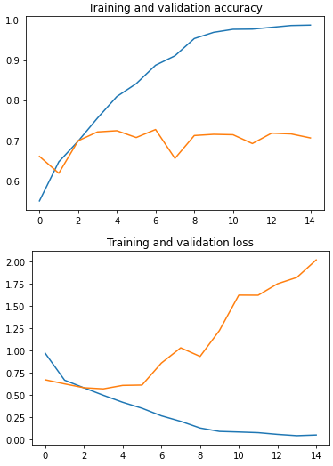

# Exploring a Larger Dataset

在 Course 1 中使用了 1000 張人和馬的圖片，現在要來看更大的 25000 張貓和狗的圖片 !

在處理大型資料集時，資料有時會變得非常雜亂、甚至損壞，需要進行 "clean" 的動作

## Training with the cats vs. dogs dataset

首先來試試用 Course 1 學到的方法來完成 kaggle 舊的圖片辨識競賽 [「Dogs vs. Cats」](https://www.kaggle.com/c/dogs-vs-cats)

1. 將[資料](https://www.kaggle.com/c/dogs-vs-cats/data)下載下來，存成 `ImageDataGenerator` 方便讀取的格式
2. 用 `ImageDataGenerator` 來載入 train/val dataset
3. 建立 `CNN model` 並且觀察 `model.summary()` 然後 `model.compile()`
4. `model.fit()` 開始訓練
5. Prediction

詳細可以到 colab 實際操作一遍: https://colab.sandbox.google.com/github/lmoroney/dlaicourse/blob/master/Course%202%20-%20Part%202%20-%20Lesson%202%20-%20Notebook.ipynb

```
Epoch 15/15
100/100 - 8s - loss: 0.0470 - accuracy: 0.9870 - val_loss: 2.0208 - val_accuracy: 0.7060
```

結果我們的 Accuracy 只能到達 70% 左右

例如這張小貓咪，就被 predict 成 dog !?


我們可以展開 train/validation loss 和 accuracy 來看，很明顯的是 overfitting 了

> * Overfitting happens when a model exposed to too few examples learns patterns that do not generalize to new data, i.e. when the model starts using irrelevant features for making predictions.
> * For instance, if you, as a human, only see three images of people who are lumberjacks, and three images of people who are sailors, and among them the only person wearing a cap is a lumberjack, you might start thinking that wearing a cap is a sign of being a lumberjack as opposed to a sailor. You would then make a pretty lousy lumberjack/sailor classifier.

``` python
acc      = history.history['accuracy']
val_acc  = history.history['val_accuracy']
loss     = history.history['loss']
val_loss = history.history['val_loss']

plt.plot(epochs, acc)
plt.plot(epochs, val_acc)
plt.title ('Training and validation accuracy')
plt.figure()

plt.plot(epochs, loss)
plt.plot(epochs, val_loss)
plt.title('Training and validation loss')
```



我們只用了 25000 張圖片中的 3000 筆資料來進行 cats vs. dogs 的競賽，若是使用全部的圖片一定可以提升結果

但在使用這個殺手鐧之前，先到 week 2 看看還有別的方法可以進步 !

# Exercise

在 exercise 5 當中，我們來試著使用 25000 張，看看能不能解決 overfitting 的問題

在載入資料時，可能出現 "EXIF data being missing or corrupt" 的警告，但別擔心，不會影響訓練結果 !

[Exercise 5 的解答在這裡](exercise5.ipynb)
