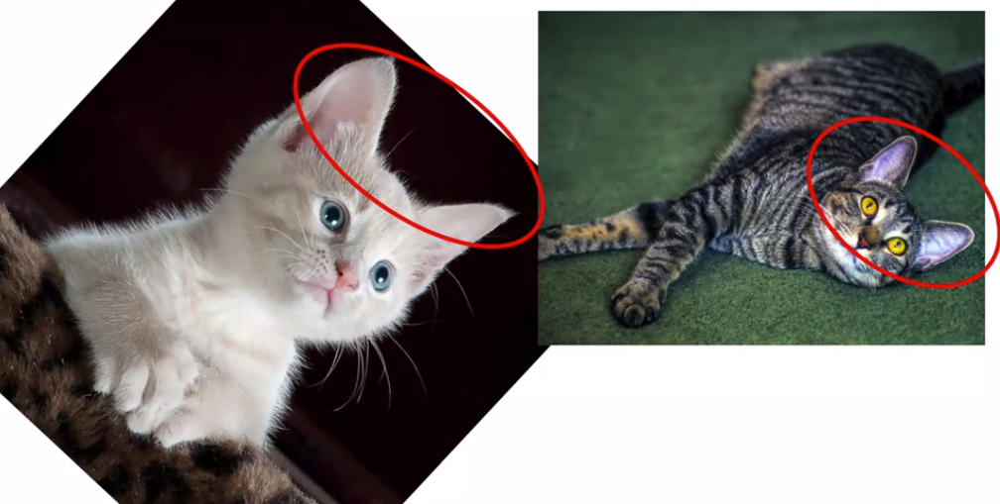
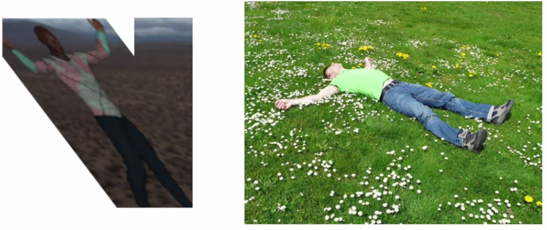
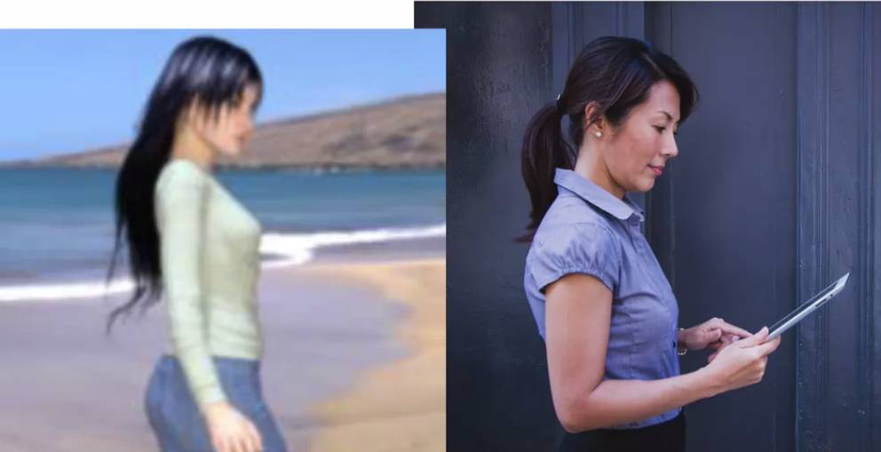
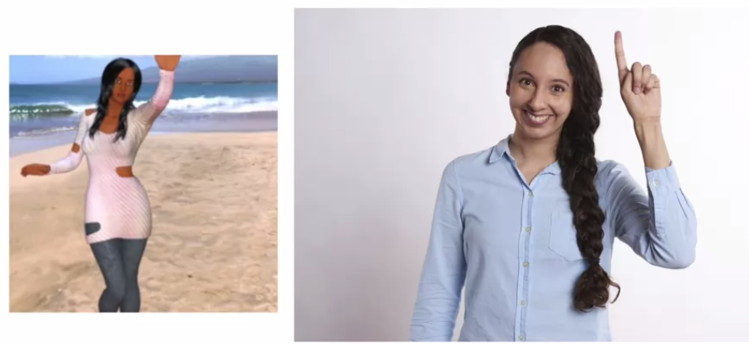
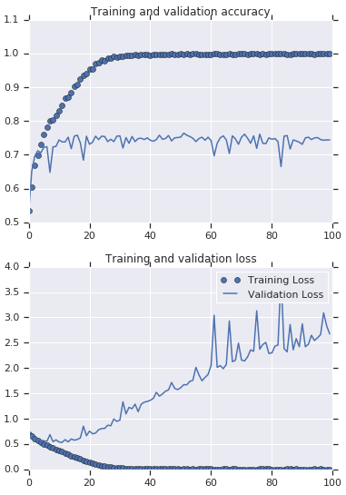
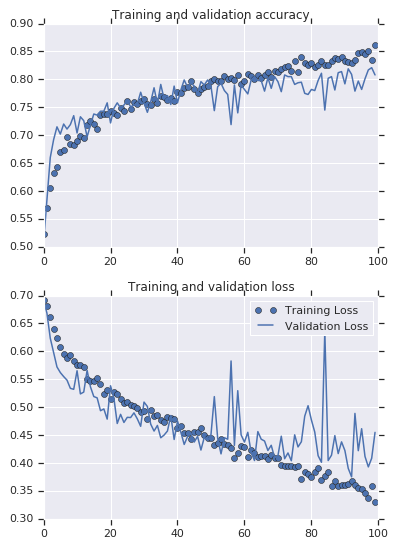
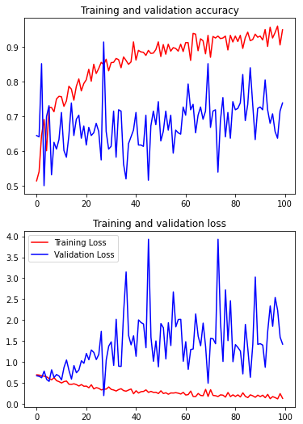

# Augmentation: A technique to avoid overfitting

在只有少量資料的時候，可以使用 data augmentation 的方式，也就是對圖片進行"旋轉、傾斜、縮放"，來避免 overfitting 的情況

例如當訓練資料只有站立的貓，那未來就預測不了躺著的是貓，我們可以將站立的貓轉向 90 度使他變成躺著的貓

Data augmentation 是所有訓練前一定會做的事情，Keras 可以進行這類預處理 (preprocessing) 並且不改動到任何原本的圖片

* For more details
* https://github.com/keras-team/keras-preprocessing
* https://keras.io/preprocessing/image/
* https://www.tensorflow.org/api_docs/python/tf/keras/preprocessing/image/ImageDataGenerator

## Introduction augmentation

在餵食模型無限多圖片之前，我們可以用簡單的 augmentation 來增加資料量及資料的多樣性

例如圖片中的貓咪可以被旋轉，讓他使用一張圖片就能抓到貓咪在另一種姿勢下的特徵



## Coding augmentation with ImageDataGenerator

我們可以直接修改 `ImageDataGenerator` 內的參數，就能實現 data augmentation

``` python
train_datagen = ImageDataGenerator(
    rescale=1./255,
    rotation_range=40,
    width_shift_range=0.2,
    height_shift_range=0.2,
    shear_range=0.2,
    zoom_range=0.2,
    horizontal_flip=True,
    fill_mode='nearest'
)
```

### `rotation_range`

決定圖片隨機被旋轉多少度 (0-180 度)，這邊的 40 代表 0 到 40 度隨機產生

### `width_shift_range` and `height_shift_range`

決定圖片在原本的 frame 中被 **"左右"** 和被 **"上下"** 偏移多少

因為有的圖片永遠都將主角放在正中央，可能造成 overfitting

### `shear_range`

Shear 可以扭曲 x-axis 讓圖片達到下圖左方的效果，看起來像右方一樣



### `zoom_range`

Zoom 可以放大圖片，讓下圖左方的圖片看起來像右方一樣



### `horizontal_flip`

我們圖片中可能沒有人類是舉左手的，我們可以用水平翻轉讓舉起右手的圖片看起來像舉左手



### `fill_mode`

我們可以將邊界缺失的 pixel 補齊，有四種方法 (假設我有 abcd 像素):

1. `constant`
   * kkkkkkkk|**abcd**|kkkkkkkk (cval=k)
2. `nearest`
   * aaaaaaaa|**abcd**|dddddddd
3. `reflect`
   * abcddcba|**abcd**|dcbaabcd
4. `wrap`
   * abcdabcd|**abcd**|abcdabcd

## Demonstrating overfitting in cats vs. dogs

在只有 3000 張貓和狗圖片，且還沒使用 data augmentation 的時候

四層 convolutional layers 且運行 100 epochs 會得到以下結果



## Adding augmentation to cats vs. dogs

現在我們加入 data augmentation 的參數到 `ImageDataGenerator` 當中

``` python
train_datagen = ImageDataGenerator(
    rescale=1./255,
    rotation_range=40,
    width_shift_range=0.2,
    height_shift_range=0.2,
    shear_range=0.2,
    zoom_range=0.2,
    horizontal_flip=True,
    fill_mode='nearest')
```

一樣是四層 convolutional layers 且運行 100 epochs:



Tensorflow 2 簡單的使用 data augmentation 將只有 3000 筆的小資料集模擬 (透過平移圖片、旋轉圖片、傾斜圖片、翻轉圖片等) 形成很大的資料集，並取得了一些成功 !

## Exception on Horse vs. Human dataset !

我們將相同的 data augmentation 方法用於 Horse vs. Human 資料集時，在 validation 的地方卻還是在 60%-70% 之間飄移不定 !



這個原因是因為 validation 和 training data 長的太像了 !


Training data 在進行完 augmentation 之後，反正變得看不懂 validation 了 🙄

在這種情況下，我們應該進行一下 validation dataset 的 design，或者要對 validation 也進行 augmentation 才對 😉

# Exercise

Exercise 6 跟 exercise 5 幾乎一模一樣，要對 full version 的 cats vs. dogs 進行訓練

不過這次要在訓練中加入 **data augmentation** !

並試試看能不能辨識以下這張比較難的狗狗圖片:


[Exercise 6 的解答在這裡](exercise6.ipynb)