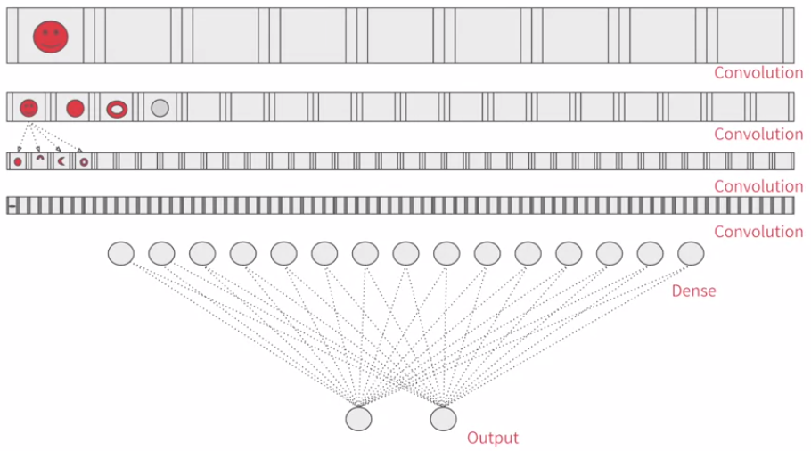
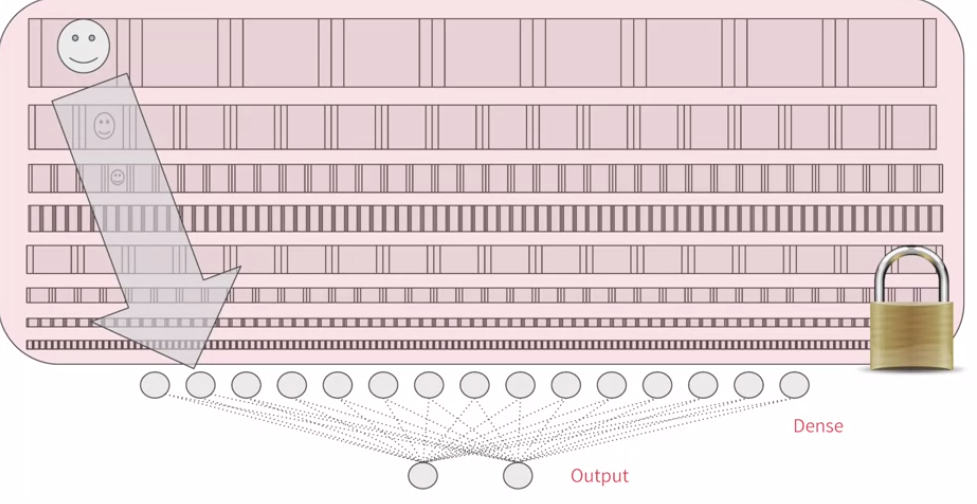
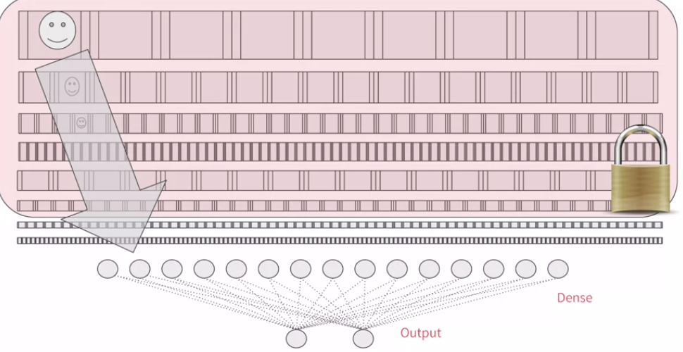
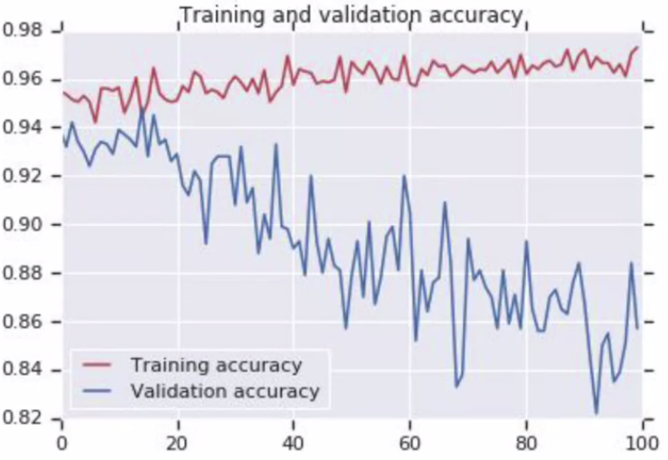
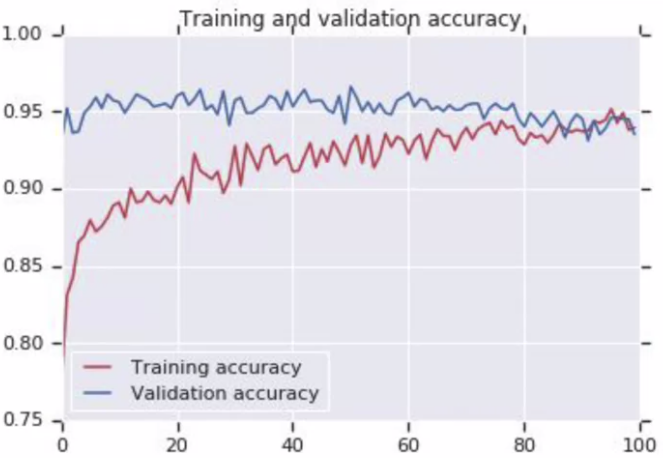

# Transfer Learning

Transfer learning 指的是套用別人訓練過的強大 model 到自己的任務上 (站在巨人肩膀)

我們可以將別人 model layers 的參數給凍結住，在下游添加自己需求的 DNN 來完成自己的任務

## Understanding transfer learning: the concepts

想像這是你用於辨識笑臉哭臉的 CNN 模型，架構又小、參數學的圖片又少



但現在你有了別人的 CNN 模型，架構又大、學的圖片又超多



我們可以將別人的模型全部鎖住 (不會被我們的新資料感染)，也可以開啟比較接近 DNN 的最後幾層讓它們被更新



> * 這裡有官方用 MobileNet 示範如何 freeze/lock layers
> * https://www.tensorflow.org/tutorials/images/transfer_learning

在以下的段落中，所有的 Colab 程式碼可以在這邊嘗試: https://colab.research.google.com/github/lmoroney/dlaicourse/blob/master/Course%202%20-%20Part%206%20-%20Lesson%203%20-%20Notebook.ipynb

## Coding transfer learning from the inception mode

我們可以從 `tensorflow.keras.applications` 這個 package 載入各種訓練好的 pretrained model

``` py
from tensorflow.keras.applications.inception_v3 import InceptionV3

pre_trained_model = InceptionV3(input_shape = (150, 150, 3), 
                                include_top = False, 
                                weights = None)

# Download pretrained model weights
!wget --no-check-certificate \
    https://storage.googleapis.com/mledu-datasets/inception_v3_weights_tf_dim_ordering_tf_kernels_notop.h5 \
    -O /tmp/inception_v3_weights_tf_dim_ordering_tf_kernels_notop.h5


pre_trained_model.load_weights(local_weights_file)
```

上面我們載入了 pretrained `InceptionV3`，這些參數代表:

1. `input_shape` 是我們圖片的輸入大小
   1. 若 `include_top=True` 那就要根據該模型預設的 input size 來訓練
2. `include_top` 是否要在這個 pretrained model 的最前面加入 fully-connected layer
3. `weights` 是否要載入 pretrained 的 weights
   1. `None` 會隨機產生、或讓你載入你的 weights
   2. `'imagenet'` 會載入在 imagenet 訓練出的 weights

在上面我們設定 weights 為 `None` 並且用 `model.load_weights()` 來載入我們下載好的 weights (某些情況我們可能不想用 imagenet 訓練的參數作為預設參數)

再來我們要將每一層 pretrained layers 凍結、鎖定起來

``` py
from tensorflow.keras import layers

for layer in pre_trained_model.layers:
    layer.trainable = False
```

你可以使用 `pre_trained_model.summary()` 看看 InceptionV3 龐大的架構 !

## Coding your own model with transferred features

我們可以任選一個 convolutional layer 作為連接我們新 Dense 的最後一層

我們選擇 `mixed7` 而不是之後的 layers 看能不能保留一些多樣性 (可以多嘗試)

```
________________________________________________________________________________________
mixed7 (Concatenate)            (None, 7, 7, 768)    0           activation_60[0][0]              
                                                                 activation_63[0][0]              
                                                                 activation_68[0][0]              
                                                                 activation_69[0][0]
________________________________________________________________________________________
```

做法如下，使用 `model.get_layer(name)` 來取得 layer，再從 `layer.output()` 得到該層結果

``` py
last_layer = pre_trained_model.get_layer('mixed7')
print('last layer output shape: ', last_layer.output_shape)
last_output = last_layer.output

# last layer output shape:  (None, 7, 7, 768)
```

再來是將平常建立 `keras.Sequential` 的方法，改用 `keras.Model` 來建立

``` py
from tensorflow.keras.optimizers import RMSprop
from tensorflow.keras import Model

x = layers.Flatten()(last_output) # Flatten the mixed7 layer
x = layers.Dense(1024, activation='relu')(x)
x = layers.Dense(1, activation='sigmoid')(x)

model = Model(pre_trained_model.input, x)
model.compile(optimizer = RMSprop(lr=0.0001),
              loss = 'binary_crossentropy',
              metrics = ['accuracy'])
```

我們一樣用 `ImageDataGenerator` + `augmentation` 來載入並訓練 20 epochs

但卻發現結果還是 overfitting 了



為什麼，我們不是已經使用 pretrained model 和 augmentation 了嗎 ?

## Exploring dropouts

在使用 InceptionV3 這種超大型架構時，可能會遇到兩個問題:

1. 鄰近的 neurons 可能得到相似的 weights 然後導致 overfitting
2. 某個 neuron 過度解讀前一層的結果，然後不斷往下傳，一樣導致 overfitting

解決方法就是使用 dropout，機率性的讓某些 neuron 喪失功能


我們只要在建立 layers 時加一層 `layers.Dropout` 即可!

``` py
x = layers.Flatten()(last_output) # Flatten the mixed7 layer
x = layers.Dense(1024, activation='relu')(x)
x = layers.Dropout(0.2)(x)
x = layers.Dense(1, activation='sigmoid')(x)
```

Dropout 中的參數代表 neuron 被隱藏的機率，這邊是 0.2

有了 dropout 的結果如下:



> * For more details on Dropout
> * https://www.youtube.com/watch?v=ARq74QuavAo


# Exercise

在 Exercise 7 中要用 transfer learning 來完成 Horse vs. Human 的任務

當 training accuracy 在 99.9% 的時候，對應的 validation accuracy 應該要能維持在 95%

而且應該要能在 100 個 epochs 之內得到上述的結果

[Exercise 7 的解答在這裡](exercise7.ipynb)