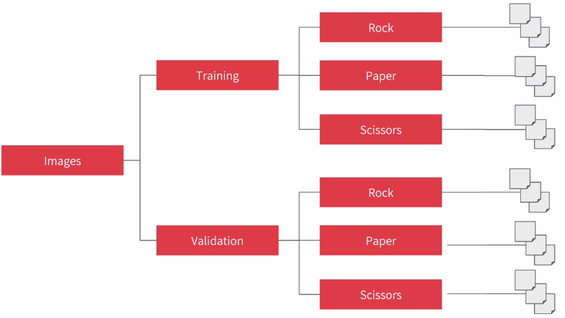
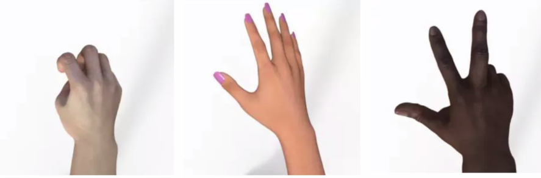
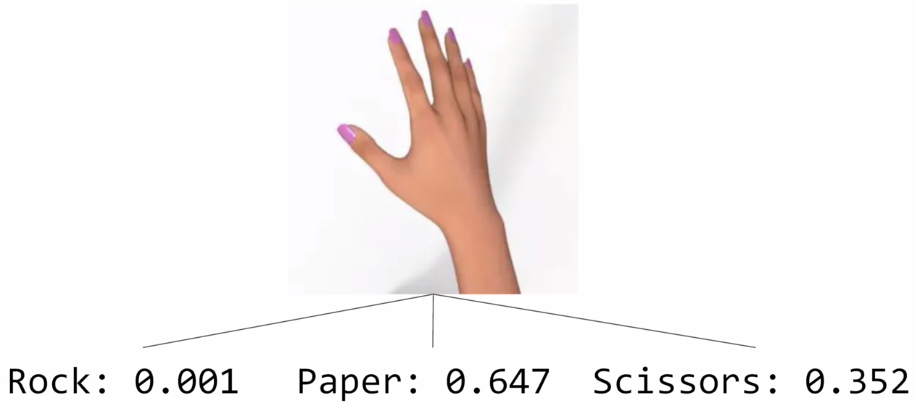

# Multiclass Classifications

不論是在 Human vs. Horse 或是 Cats vs. Dogs 都是在分類兩種東西而已，那三種東西以上要怎麼分類呢?

三種東西以上的分類問題稱為 multi-class classification! 其實在 FASHION NMIST 就有成功分類過十種服裝了，只是我們沒有深入了解實作過程而已 !

## Moving from binary to multi-class classification

要從二分類到 multi-class 的分類很簡單，第一步只要把 folder 多加幾個就好

以下是一個分類 **"剪刀石頭布"** 該存放的目錄:



## Explore multi-class with Rock Paper Scissors dataset

這個 **Rock Paper Scissors** 資料集共包含 2892 張圖片，每張圖片都是用 CGI 技術產生出來的

裡面的手包含各種顏色、大小、年齡、性別的 "剪刀、石頭、布"



每張圖片為 300x300 (24-bit color)

資料集可以在這裡下載: 
http://www.laurencemoroney.com/rock-paper-scissors-dataset/

## Train a classifier with Rock Paper Scissors

第一個要改的是 `ImageDataGenerator` 的部份，從 `class_mode='binary'` 改為 `'categorical'`

``` python
TRAINING_DIR = "/tmp/rps/train/"
training_datagen = ImageDataGenerator(rescale = 1./255)

train_generator = training_datagen.flow_from_directory(
    TRAINING_DIR,
    target_size=(150, 150),
    batch_size=128,
    class_mode='categorical' # Multi-class mode
)
```

第二個要修改的是 Model 的最後輸出部份，從 1 個輸出配 `sigmoid` 變成 3 個輸出配 `softmax`

``` python
model = tf.keras.models.Sequential([
    ...
    ...
    tf.keras.layers.Dense(3, activation='softmax')
])
```

第三個是更改 compile 時的 loss function，要從 `binary_crossentropy` 改為 `categorical_crossentropy` 或是 `sparse_categorical_crossentropy` 等

``` python
from tensorflow.keras.optimizers import RMSprop

model.compile(loss='categorical_crossentropy',
              optimizer=RMSprop(lr=0.001),
              metrics=['acc'])
```

產生的結果就會像下圖一樣，變成維度為三的向量: `[0.001, 0.647, 0.352]`



會依資料夾的順序排序 Rock, Paper, Scissors (alphabetical) 的機率，加總為 1

## Test the Rock Paper Scissors classifier

完整的程式碼可以到這裡查看 https://colab.research.google.com/github/lmoroney/dlaicourse/blob/master/Course%202%20-%20Part%208%20-%20Lesson%202%20-%20Notebook%20(RockPaperScissors).ipynb

# Exercise

有了 multiclass 的概念後，試著來解決 [Kaggle](https://www.kaggle.com/datamunge/sign-language-mnist) 上這個分類 Sign Language 的競賽吧 !

資料集可以在這裡下載: https://www.kaggle.com/datamunge/sign-language-mnist/home

[Exercise 8 的解答在這裡](exercise8.ipynb)