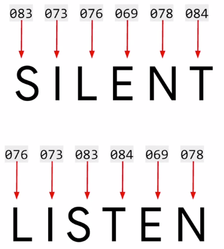
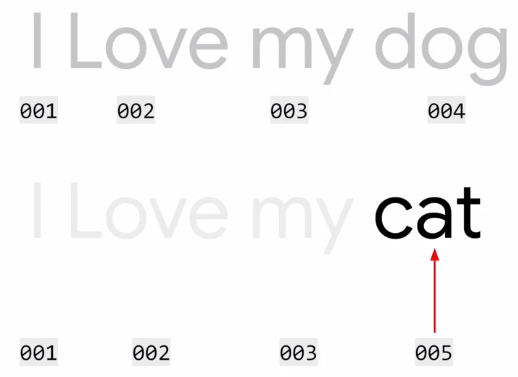

# Sentiment in text

我們將文字的情感分類，作為第一個實作在文字上的任務，但首先要怎麼將文字表達成一堆數字呢 ?

## Word based encodings

第一個想到把文字用數字表達的方法是 ASCII code



但這個方法沒有辦法表達出文字的意義，甚至上面兩個的 ASCII 看起來很像但在意義上卻有蠻大的差別



第二個方法我們把文字標上號碼，只看號碼的時候似乎就能看出數字的相似度 (和句子關聯度成正比)

### API

Tensorflow 提供 API 能夠實作上面的第二個方法，快速標註每個單字的號碼

``` python
from tensorflow.keras.preprocessing.text import Tokenizer

sentences = ['i love my dog',
             'I, love my cat',
             'You love my dog!' ]


tokenizer = Tokenizer(num_words=100)
tokenizer.fit_on_texts(sentences)
tokenizer.word_index

# {'cat': 5, 'dog': 4, 'i': 3, 'love': 1, 'my': 2, 'you': 6}
```

1. 建立 Tokenizer 要輸入 `num_words=n` 參數，建立一個大小為 n 的字典來存放 **token**
   1. 單字數超過 n 時，會自動選前 n 最常出現的單字
2. Tokenizer 的 `fit_on_texts()` 會將餵入句子的每個單字轉換成 **token**
   1. 會自動小寫
   2. 會自動去掉標點符號
3. `word_index` 這個 property 可以顯示字典的單字和 **token** 對應表

## Text to sequence

