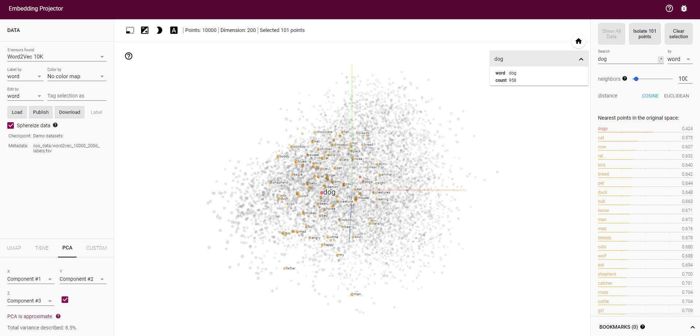
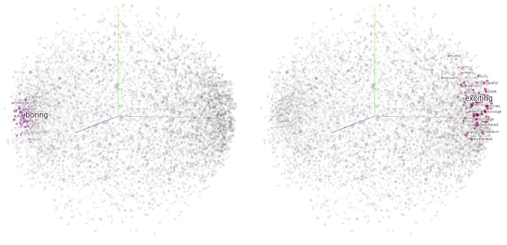
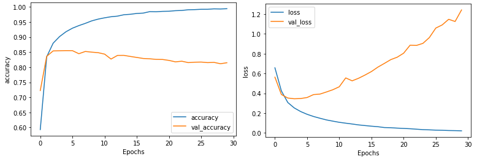

# Word Embeddings

除了用號碼表達每個文字，還可以使用 word embedding 來表達每個文字，能夠更準確的抓出文字之間的關聯性

## Introduction

我們可以用 convolution 來擷取圖片的特徵，在文字任務中也有相似功用的工具: Embeddings

Embeddings 可以將文字表示為高維度的向量，在這向量空間中，類似涵義的文字的向量就會靠近在一起

我們可以在 [projector.tensorflow.org](http://projector.tensorflow.org/) 查看訓練出來的 embedding 空間



接下來將分成兩個 dataset 來展示如何訓練出 embedding 並能順利分類

1. IMDb Review dataset
2. SARCASM dataset

## IMDb Review dataset

[IMDb Review dataset](http://ai.stanford.edu/~amaas/data/sentiment/) 是用來預測電影評論是好評還是負評的資料集，大約有 50,000 筆評論

我們可以用 tensorflow 內建的 `tensorflow_dataset` 來載入這個資料集，載入時會幫我們做好 shuffle 等工作

``` python
import tensorflow_datasets as tfds
imdb, info = tfds.load("imdb_reviews", with_info=True, as_supervised=True)

train_data, test_data = imdb['train'], imdb['test']
```

我們各別載入 25,000 筆用於 train 和 test，並導入到 sentences 和 labels 兩個列表中

``` python
training_sentences = []
training_labels = []

for s,l in train_data:
  training_sentences.append(s.numpy().decode('utf8'))
  training_labels.append(l.numpy())

training_labels_final = np.array(training_labels) # 把 list 轉成 ndarray
```

再來就是對 sentence 做 tokenize, padding 的工作，我們先定義一些要用的參數

``` python
vocab_size = 10000
embedding_dim = 16
max_length = 120
trunc_type='post'
oov_tok = "<OOV>"
```

Tokenize 的部分和之前一模一樣

``` python
from tensorflow.keras.preprocessing.text import Tokenizer
from tensorflow.keras.preprocessing.sequence import pad_sequences

tokenizer = Tokenizer(num_words = vocab_size, oov_token=oov_tok)
tokenizer.fit_on_texts(training_sentences)
sequences = tokenizer.texts_to_sequences(training_sentences)
padded = pad_sequences(sequences,maxlen=max_length, truncating=trunc_type)

testing_sequences = tokenizer.texts_to_sequences(testing_sentences)
testing_padded = pad_sequences(testing_sequences,maxlen=max_length)
```

要實作 Embedding 只需要在 model 的第一層加入即可，裡面的 `Flatten()` 可以用 `GlobalAveragePooling1D()` 取代

1. `Flatten()` 較慢、參數較多、效果較好
2. `GlobalAveragePooling1D()` 較快、參數少、效果可能差一點點

``` python
import tensorflow as tf

model = tf.keras.Sequential([
    tf.keras.layers.Embedding(vocab_size, embedding_dim, input_length=max_length),
    tf.keras.layers.Flatten(),
    tf.keras.layers.Dense(6, activation='relu'),
    tf.keras.layers.Dense(1, activation='sigmoid')
])
model.compile(loss='binary_crossentropy',optimizer='adam',metrics=['accuracy'])
model.summary()

# Model: "sequential"
# _________________________________________________________________
# Layer (type)                 Output Shape              Param #   
# =================================================================
# embedding (Embedding)        (None, 120, 16)           160000    
# _________________________________________________________________
# flatten (Flatten)            (None, 1920)              0         
# _________________________________________________________________
# dense (Dense)                (None, 6)                 11526     
# _________________________________________________________________
# dense_1 (Dense)              (None, 1)                 7         
# =================================================================
# Total params: 171,533
# Trainable params: 171,533
# Non-trainable params: 0
# _________________________________________________________________
```

句子由 token 形式進入模型，先變成 embedding 再開始進到 DNN，我們得到了 `val_accuracy: 0.8338` 的成績

``` python
model.fit(padded, training_labels_final, epochs=10, validation_data=(testing_padded, testing_labels_final))

# Epoch 10/10
# 782/782 [==============================] - 5s 6ms/step - loss: 1.7897e-04 - accuracy: 1.0000 - val_loss: 0.7989 - val_accuracy: 0.8338
```

接著是重頭戲，將 embedding 輸出，並到 [projector.tensorflow.org](http://projector.tensorflow.org/) 投影出來 !

``` python
e = model.layers[0]
weights = e.get_weights()[0]
print(weights.shape) # (10000, 16)

import io
reverse_word_index = dict([(value, key) for (key, value) in word_index.items()])

out_v = io.open('vecs.tsv', 'w', encoding='utf-8')
out_m = io.open('meta.tsv', 'w', encoding='utf-8')
for word_num in range(1, vocab_size):
  word = reverse_word_index[word_num]
  embeddings = weights[word_num]
  out_m.write(word + "\n")
  out_v.write('\t'.join([str(x) for x in embeddings]) + "\n")
out_v.close()
out_m.close()
```

我們的 embedding size 為 10000*16，我們下載他的 `vecs.tsv` 和 `meta.tsv` 就可以放到網站上了

1. `vecs` 儲存著 10,000 個字個別的 embedding vector
2. `meta` 則是對應的每個字

可以看到結果中，對電影來說正向的詞都在右邊，負評會出現的詞都在左邊



## Sarcasm dataset

我們一樣把 Sarcasm dataset 也玩了一遍，可以到 [這裡操作](https://colab.research.google.com/github/lmoroney/dlaicourse/blob/master/TensorFlow%20In%20Practice/Course%203%20-%20NLP/Course%203%20-%20Week%202%20-%20Lesson%202.ipynb) 看看

```
Epoch 28/30
625/625 - 3s - loss: 0.0248 - accuracy: 0.9937 - val_loss: 1.1463 - val_accuracy: 0.8161
Epoch 29/30
625/625 - 3s - loss: 0.0237 - accuracy: 0.9933 - val_loss: 1.1242 - val_accuracy: 0.8116
Epoch 30/30
625/625 - 3s - loss: 0.0218 - accuracy: 0.9941 - val_loss: 1.2407 - val_accuracy: 0.8149
```



我們發現 validation loss 增加的十分快速，這種事情在訓練大量文字時容易發生

要改進的方法是透過不斷 **tuning hyperparameters**

例如將一些參數修改後，loss 就停止增加了，但 accuracy 也沒辦法到達 90 以上:

``` python
vocab_size = 1000 # (was 10000)
embedding_dim = 16 
max_length = 50   # (was 100)
trunc_type='post'
padding_type='post'
oov_tok = "<OOV>"
training_size = 20000
```


**Tuning hyperparameters** 要如何找到最棒的平衡，是訓練模型中非常重要的一環

## Pre-tokenized dataset

最後提供一個方法能夠直接載入 tensorflow 提供的已經 tokenized 的 dataset 

完整的 dataset 清單可以到 [Tensorflow Datasets](https://www.tensorflow.org/datasets/catalog/overview) 查詢，我們要使用的是 [imdb_reviews/subwords8k](https://www.tensorflow.org/datasets/catalog/imdb_reviews)

Subword 會將文字切成更小塊的單位，這在 RNN 訓練時有很好的效果，但這邊我們先試著應用到普通的 DNN 看看

``` python
import tensorflow_datasets as tfds
imdb, info = tfds.load("imdb_reviews/subwords8k", with_info=True, as_supervised=True)
```

tokenizer 會附在 info 裡面，並且已經自動為我們添加好字典了

這個 tokenizer 是 `tfds.features.text.SubwordTextEncoder` 可以到這邊看他的 [documentation](https://www.tensorflow.org/datasets/api_docs/python/tfds/features/text/SubwordTextEncoder)

``` python
train_data, test_data = imdb['train'], imdb['test']
tokenizer = info.features['text'].encoder
print(len(tokenizer.subwords))
# 7928
print(tokenizer.subwords)
# ['the_', ', ', '. ', 'a_', 'and_', 'of_', 'to_', 's_', 'is_', 'br', 'in_', 'I_', 'that_', 'this_', 'it_', ...]
```

我們可以用 `encode` 或 `decode` 來取代 `texts_to_sequences`

``` python
sample_string = 'TensorFlow, from basics to mastery'
tokenized_string = tokenizer.encode(sample_string)
print(tokenized_string)
# [6307, 2327, 4043, 2120, 2, 48, 4249, 4429, 7, 2652, 8050]

original_string = tokenizer.decode(tokenized_string)
print(original_string)
# TensorFlow, from basics to mastery

for ts in tokenized_string:
    print ('{} ----> {}'.format(ts, tokenizer.decode([ts])))
# 6307 ----> Ten
# 2327 ----> sor
# 4043 ----> Fl
# 2120 ----> ow
# 2    ----> , 
# 48   ----> from 
# 4249 ----> basi
# 4429 ----> cs 
# 7    ----> to 
# 2652 ----> master
# 8050 ----> y
```

完整的程式可以到這邊參考: https://colab.research.google.com/github/lmoroney/dlaicourse/blob/master/TensorFlow%20In%20Practice/Course%203%20-%20NLP/Course%203%20-%20Week%202%20-%20Lesson%203.ipynb

# Exercise

在 exercise 2 要繼續上次的 [BBC text archive](http://mlg.ucd.ie/datasets/bbc.html) 進行預測文章的種類

1. Download and preprocess (remove stopwords) the dataset
2. Tokenize the dataset (sentences, labels)
3. Build the model and train with **embedding**
4. Download the meta, vecs data to visualize embedding

[Exercise 2 的解答在這裡](exercise2.ipynb)