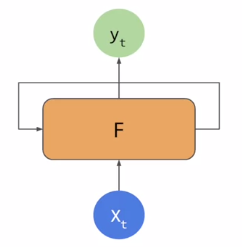
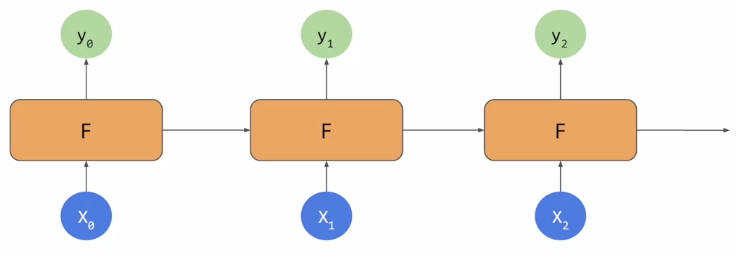
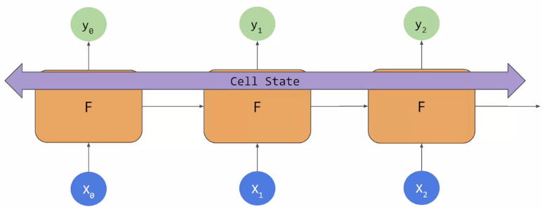
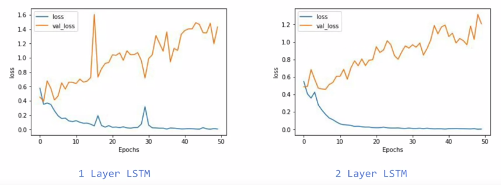
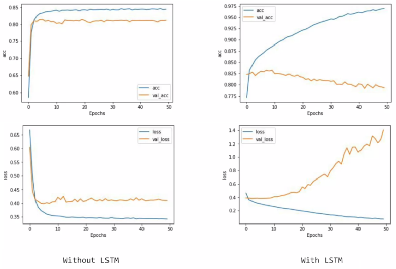
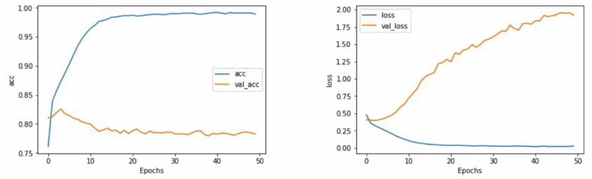
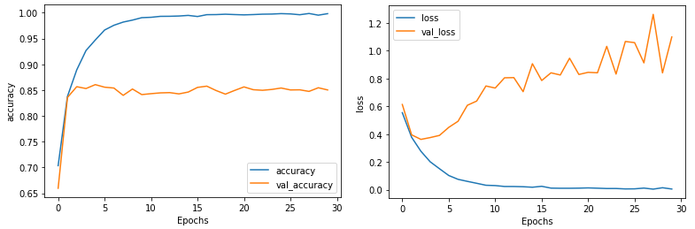

# Sequence models

當句子的文字被拆成一個個進到模型訓練時，會失去整個句子的意義，這就是 sequence meaning 的重要之處

最常見的 Sequence model 叫作 **RNN (Recurrent Neural Network)**

可以用下圖單個模型表示，每次產生結果用於下一次的訓練中



也可以用串在一起表示:



完整的 sequence modeling 課程可以參考這裡: https://www.coursera.org/lecture/nlp-sequence-models/deep-rnns-ehs0S

## LSTMs

簡單的 RNN 可以猜到簡短句子中的文字，但有可能猜不到長度較長的句子中的文字

```
Today has a beautiful blue <...>
Today has a beautiful blue sky

可以從 blue 猜到 sky 很簡單

I lived in Ireland, so at school they made me learn how to speak <...>
I lived in Ireland, so at school they made me learn how to speak Gaelic

要從 Ireland 猜到 Gaelic 有點困難
```

**LSTM (Long short-term memory)** 這個 RNN 架構能夠在網路中加入 Cell State 這個 pipeline 來傳遞前面的 token 影響後面的判斷



這個 cell state 可以是雙向的，代表後面的 token 也能影響前面的判斷

更多的 lstm 課程可以參考這裡: https://www.coursera.org/lecture/nlp-sequence-models/long-short-term-memory-lstm-KXoay

# Implementing LSTMs in code

使用 LSTM 只需要在 model 加入一層 `tf.keras.layers.LSTM(units)` 即可

`units` 是我希望的 output 數量

要使用雙向的 LSTM 就使用 `tf.keras.layers.Bidirectional(lstm)` 包起來就好

用了 `Bidirectional` 則 output 數量就會變成兩倍 !

``` python
model = tf.keras.Sequential([
    tf.keras.layers.Embedding(tokenizer.vocab_size, 64),
    tf.keras.layers.Bidirectional(tf.keras.layers.LSTM(64)),
    tf.keras.layers.Dense(64, activation='relu'),
    tf.keras.layers.Dense(1, activation='sigmoid')
])

# _________________________________________________________________
# Layer (type)                 Output Shape              Param #   
# =================================================================
# embedding (Embedding)        (None, None, 64)          523840    
# _________________________________________________________________
# bidirectional (Bidirectional (None, 128)               66048     
# _________________________________________________________________
# dense (Dense)                (None, 64)                8256      
# _________________________________________________________________
# dense_1 (Dense)              (None, 1)                 65        
# =================================================================
# Total params: 598,209
# Trainable params: 598,209
# Non-trainable params: 0
```

可以在模型中疊上多個 LSTMs，但前面的 LSTM 需要加入參數 `return_sequences=True`

``` python
model = tf.keras.Sequential([
    tf.keras.layers.Embedding(tokenizer.vocab_size, 64),
    tf.keras.layers.Bidirectional(tf.keras.layers.LSTM(64, return_sequences=True)),
    tf.keras.layers.Bidirectional(tf.keras.layers.LSTM(32)),
    tf.keras.layers.Dense(64, activation='relu'),
    tf.keras.layers.Dense(1, activation='sigmoid')
])

# _________________________________________________________________
# Layer (type)                 Output Shape              Param #   
# =================================================================
# embedding (Embedding)        (None, None, 64)          523840    
# _________________________________________________________________
# bidirectional (Bidirectional (None, None, 128)         66048     
# _________________________________________________________________
# bidirectional_1 (Bidirection (None, 64)                41216     
# _________________________________________________________________
# dense (Dense)                (None, 64)                4160      
# _________________________________________________________________
# dense_1 (Dense)              (None, 1)                 65        
# =================================================================
# Total params: 635,329
# Trainable params: 635,329
# Non-trainable params: 0
# _________________________________________________________________
```

我們發現使用兩層 LSTM 時，結果會更加 "smooth"，但一樣都待修改 hyperparameters 來解決 overfitting



## With/Without LSTMs

我們可以比較有無使用 LSTM 的兩種結果:

``` python
tf.keras.layers.Flatten(),
tf.keras.layers.GlobalAveragePooling1D(),

vs.

tf.keras.layers.Bidirectional(tf.keras.layers.LSTM(32))
```



沒有使用 LSTM 時，train 和 val 都會到達一個地方就卡關

|      | train | val |
| ---- | ----- | --- |
| acc  | 0.85  | 0.8 |
| loss | 0.35  | 0.4 |

而使用 LSTM 時，train 可以超越 90% 以上，但 val 卻發生 overfitting

|      | train    | val     |
| ---- | -------- | ------- |
| acc  | **0.97** | 0.8     |
| loss | 0.1      | **1.2** |


## Convolution

我們也可以用 convolution layers 來取代 RNN

``` python
model = tf.keras.Sequential([
    tf.keras.layers.Embedding(tokenizer.vocab_size, 64, input_length=120),
    tf.keras.layers.Conv1D(128, 5, activation='relu'),
    tf.keras.layers.GlobalAveragePooling1D(),
    tf.keras.layers.Dense(64, activation='relu'),
    tf.keras.layers.Dense(1, activation='sigmoid')
])

# _________________________________________________________________
# Layer (type)                 Output Shape              Param #   
# =================================================================
# embedding_2 (Embedding)      (None, 120, 64)           523840    
# _________________________________________________________________
# conv1d_2 (Conv1D)            (None, 116, 128)          41088     
# _________________________________________________________________
# global_average_pooling1d_2 ( (None, 128)               0         
# _________________________________________________________________
# dense_4 (Dense)              (None, 64)                8256      
# _________________________________________________________________
# dense_5 (Dense)              (None, 1)                 65        
# =================================================================
# Total params: 573,249
# Trainable params: 573,249
# Non-trainable params: 0
```

因為用了長度為 5 的 convolution 所以長度 120 的文字會被左右各消去 2 個字，變成 116

然後產生了 128 個 filter，經過 pooling 把 116 個字壓縮起來成 1 個向量



結果和 LSTM 類似，會出現 overfitting 現象，需要調整找到最好的 hyperparameters 才行

## GRU

另一個和 LSTM 相似的 RNN 架構是 **GRU (Gate Recurrent Unit)**，在實作上幾乎和 LSTM 一模一樣

``` python
model = tf.keras.Sequential([
    tf.keras.layers.Embedding(vocab_size, embedding_dim, input_length=max_length),
    tf.keras.layers.Bidirectional(tf.keras.layers.GRU(64)),
    tf.keras.layers.Dense(64, activation='relu'),
    tf.keras.layers.Dense(1, activation='sigmoid')
])

# _________________________________________________________________
# Layer (type)                 Output Shape              Param #   
# =================================================================
# embedding_4 (Embedding)      (None, 120, 64)           523840    
# _________________________________________________________________
# bidirectional_1 (Bidirection (None, 128)               49920     
# _________________________________________________________________
# dense_8 (Dense)              (None, 64)                8256      
# _________________________________________________________________
# dense_9 (Dense)              (None, 1)                 65        
# =================================================================
# Total params: 582,081
# Trainable params: 582,081
# Non-trainable params: 0
```



結果一樣，會出現 overfitting 現象，必須 tuning hyperparameters !

## Conclusion

文字會比圖片更容易出現 overfitting，有個原因是因為在 validation/testset 中，會出現許多的 `<OOV>`

試著 tuning 或是其他手法，看看能否降低 overfitting 的影響 !

# Exercise

這周嘗試了 non-LSTM, LSTM, Convolution, GRU 但每個都發生了 overfitting

這是因為我們的 training data 太小了，字典的詞彙量也跟著縮水，導致在預測時會出現很多 `<OOV>`

所以在 exercise 3 要試著使用 [較大的 dataset](https://www.kaggle.com/kazanova/sentiment140) 來訓練，並且加入了 [GloVe (Global Vectors for Word Representation)](https://nlp.stanford.edu/projects/glove/) 作為我們的 transfer learning 的 embedding

[Exercise 3 的解答在這裡](exercise3.ipynb)