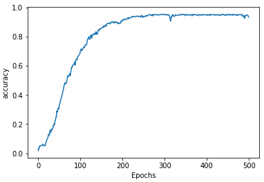
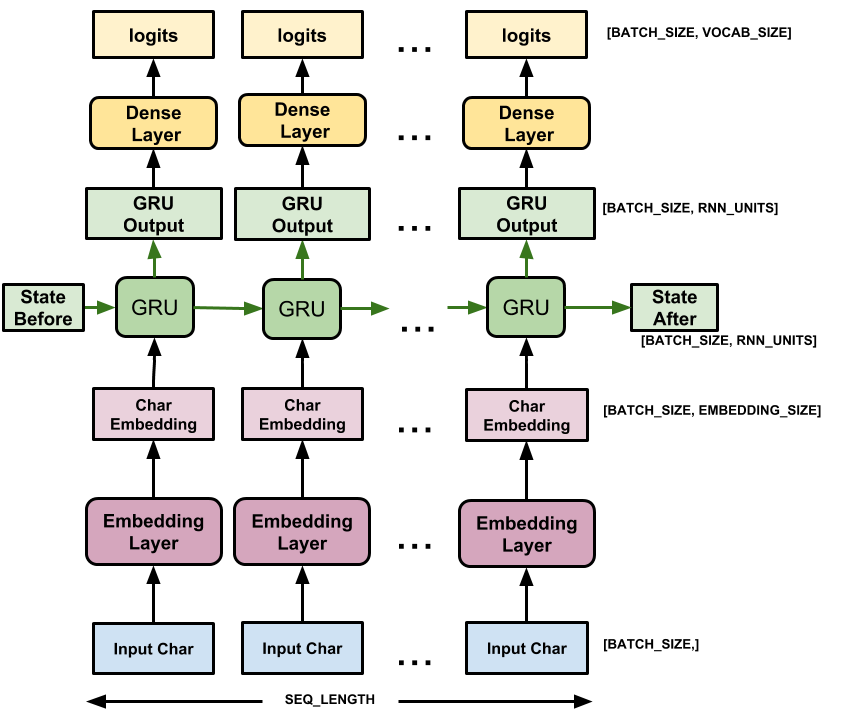
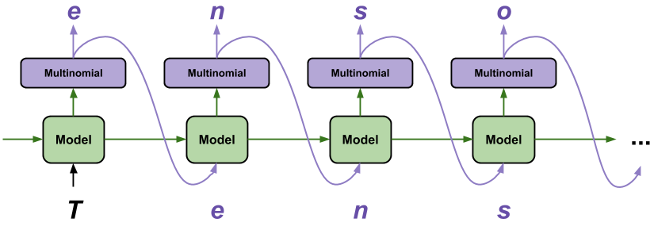

# Sequence models and literature

## Introduction

RNN 當中一個有趣的應用是讀過某個類型的文章，就可以依照該文章的風格產生出相似的作品 (e.g., shakespeare)

產生文章聽起來很難，其實跟前面幾週一樣只是在進行預測的動作而已

``` python
x = 'Twinkle Twinkle little'
y = 'star'
```

例如告訴模型我們輸入的 `Twinkle Twinkle little` 要對應的答案是 star

丟入大量類似的 corpus 進入模型訓練，未來模型就會模仿他學習過的東西創造出句子

## Preprocessing

首先要 tokenize 整個文章，單字數 +1 表示考慮進 OOV 的字，總共 263 個單字

``` python
data = "In the town of Athy one Jeremy Lanigan \n Battered away til ..."

tokenizer = Tokenizer()
corpus = data.lower().split("\n")

tokenizer.fit_on_texts(corpus)
total_words = len(tokenizer.word_index) + 1

print(tokenizer.word_index)
# {'and': 1, 'the': 2, 'a': 3, 'in': 4, ... }

print(total_words)
# 263
```

在訓練時，會把句子拆成好幾個 xs 和 ys 來訓練，每次採用最後一個單字當作 y

```
original text: 
In the town of Athy one Jeremy Lanigan


(2) In the
x: in
y: the

(3) In the town
x: in the
y: town

(4) In the town of
x: in the town
y: of

...

(8) In the town of Athy one Jeremy Lanigan
x: in the town of athy one jeremy
y: lanigan
```

所以 8 個單字的句子，可以拆出 7 個 training dataset，每個 dataset 再做 padding 來方便拆分 x, y 

``` python
[4, 2, 66, 8, 67, 68, 69, 70] 

=>

[0, 0,  0, 0,  0,  0,  4,  2],
[0, 0,  0, 0,  0,  4,  2, 66],
[0, 0,  0, 0,  4,  2, 66,  8],
[0, 0,  0, 4,  2, 66,  8, 67],
[0, 0,  4, 2, 66,  8, 67, 68],
[0, 4,  2, 66, 8, 67, 68, 69],
[4, 2, 66, 8, 67, 68, 69, 70] 

=>

x                           y
[0, 0,  0, 0,  0,  0,  4],  [ 2]
[0, 0,  0, 0,  0,  4,  2],  [66]
[0, 0,  0, 0,  4,  2, 66],  [ 8]
[0, 0,  0, 4,  2, 66,  8],  [67]
[0, 0,  4, 2, 66,  8, 67],  [68]
[0, 4,  2, 66, 8, 67, 68],  [69]
[4, 2, 66, 8, 67, 68, 69],  [70]
```

程式碼分成四個步驟: 

1. extract n-grams

``` python
input_sequences = []
for line in corpus:
	token_list = tokenizer.texts_to_sequences([line])[0]
	for i in range(1, len(token_list)):
		n_gram_sequence = token_list[:i+1]
		input_sequences.append(n_gram_sequence)

print(input_sequences) 
# [[4, 2], [4, 2, 66], [4, 2, 66, 8], [4, 2, 66, 8, 67], ... ]
```

2. padding n-grams

``` python
max_sequence_len = max([len(x) for x in input_sequences])
input_sequences = np.array(pad_sequences(input_sequences, maxlen=max_sequence_len, padding='pre'))

print(input_sequences)
# [[  0   0   0 ...   0   4   2]
#  [  0   0   0 ...   4   2  66]
#  ...
#  [  0   0   0 ... 262  13   9]
#  [  0   0   0 ...  13   9  10]]
```

3. seperate (x, y) pairs

``` python
xs, labels = input_sequences[:,:-1], input_sequences[:,-1]

print(xs)
# array([[  0,   0,   0, ...,   0,   0,   4],
#        [  0,   0,   0, ...,   0,   4,   2],
#        ...,
#        [  0,   0,   0, ...,  60, 262,  13],
#        [  0,   0,   0, ..., 262,  13,   9]], dtype=int32)

print(labels)
# array([  2,  66, ...,  9,  10], dtype=int32)
```

4. use `tf.keras.utils.to_categorical` to one-hot labels

``` python
ys = tf.keras.utils.to_categorical(labels, num_classes=total_words)

print(ys[0])
# [0. 0. 1. 0. 0. ... 0. 0.] 
# only index 2 is 1 out of 263 elements

print(ys.shape)
# (453, 263)
```

## Training

有了處理好的 dataset 就可以來建立 model 並訓練了

``` python
from tensorflow.keras.models import Sequential
from tensorflow.keras.layers import Embedding, LSTM, Dense, Bidirectional

model = Sequential([
	Embedding(total_words, 64, input_length=max_sequence_len-1),
	Bidirectional(LSTM(20)),
	Dense(total_words, 'softmax')
])

model.compile(loss='categorical_crossentropy', optimizer='adam', metrics=['accuracy'])
  history = model.fit(xs, ys, epochs=500, verbose=1)
```

結果可以到 92~95% 的準確率，但似乎在 200 epochs 時就已經收斂了

```
Epoch 499/500
15/15 [==============================] - 0s 6ms/step - loss: 0.1456 - accuracy: 0.9448
Epoch 500/500
15/15 [==============================] - 0s 5ms/step - loss: 0.1770 - accuracy: 0.9338
```




## Text Generation (Prediction)

接下來才是重頭戲，我們將文章開頭訂好，讓模型來幫我們產生之後的句子

``` python
seed_text = "Laurence went to dublin"
next_words = 100
```

每次要產生下個文字時:

1. 先把現在文字轉成 token sequence
2. 並把 sequence 補滿長度 (padding & truncate)
3. 用該 sequence 來預測下一個字 (token)
4. 去字典查出這個字的文字 (text)
5. 加入到現在的句子裡面
6. 用該句子來產生下一個字

重複進行以上動作，直到產生 100 個字

``` python
for _ in range(next_words):
	token_list = tokenizer.texts_to_sequences([seed_text])[0]
	token_list = pad_sequences([token_list], maxlen=max_sequence_len-1, padding='pre')
	# [[  0   0   0   0   0   0 134  13  59  13]]

	predicted = np.argmax(model.predict(token_list), axis=-1)
	# [19]

	output_word = ""
	for word, index in tokenizer.word_index.items():
		if index == predicted:
			output_word = word # "they"
			break
	
	seed_text += " " + output_word
	# "Laurence went to dublin they"
print(seed_text)
# "Laurence went to dublin they twas then there were runctions runctions were acres ..."
```

> * 完整的程式碼可以參考:
> * https://colab.research.google.com/github/lmoroney/dlaicourse/blob/master/TensorFlow%20In%20Practice/Course%203%20-%20NLP/Course%203%20-%20Week%204%20-%20Lesson%201%20-%20Notebook.ipynb

# generating text using a Character-based RNN

看到上面產生的句子，可以看到有的字重複了 (e.g., "runctions runctions")，原因有二

1. 訓練資料太少導致字典的字也太少了
2. 預測越拉越長，加上產生文字是由機率產生
   1. 例如產生的第一個字為 95%
   2. 第二個字為 93%，結果就是 95% * 93%
   3. 不斷的乘下來機率就會變得非常小

一個解決方法是使用 character-based 的 RNN 來進行文章產生，詳情可以看: https://www.tensorflow.org/tutorials/text/text_generation

以字母為單位，若資料為 `"Shakespear"` 那模型就要預測下一個字母為 `"e"`

莎士比亞的檔案共有 1115394 個字母 (characters)，從中可以得到 65 個獨立的字母 (vocab_size)

```
{
  '\n':   0,
  ' ' :   1,
  '!' :   2,
  '$' :   3,
  '&' :   4,
  "'" :   5,
  ',' :   6,
  '-' :   7,
  '.' :   8,
  '3' :   9,
  ':' :  10,
  ';' :  11,
  '?' :  12,
  'A' :  13,
  'B' :  14,
  'C' :  15,
  ...
}
```

前十個字母 `'First Citizen'` 就可以被轉為 `[18 47 56 57 58  1 15 47 58 47 64 43 52]`

接下來是抓出每個句子，拆成 inputs, labels

這邊用到了 `from_tensor_slices` 和 `batch` 的技巧:

* [tf.data.Dataset.from_tensor_slices](https://www.tensorflow.org/api_docs/python/tf/data/Dataset#source_datasets_2)
* [tf.data.Dataset.batch](https://www.tensorflow.org/api_docs/python/tf/data/Dataset#batch)

``` python
seq_length = 100
examples_per_epoch = len(text)//(seq_length+1)

char_dataset = tf.data.Dataset.from_tensor_slices(text_as_int)
sequences = char_dataset.batch(seq_length+1, drop_remainder=True)

def split_input_target(chunk):
    input_text = chunk[:-1]
    target_text = chunk[1:]
    return input_text, target_text

dataset = sequences.map(split_input_target)
```

Input 會和 label 前後個差一個字: 

```
Input data:  'First Citizen:\nBefore we proceed any further, hear me speak.\n\nAll:\nSpeak, speak.\n\nFirst Citizen:\nYou'
Target data: 'irst Citizen:\nBefore we proceed any further, hear me speak.\n\nAll:\nSpeak, speak.\n\nFirst Citizen:\nYou '
```

每個 index 會代表一個 time step，例如在 time step 0 的時候 `F` 就要預測下一個為 `i`

Time step 1 時，要從 i 預測下一個為 r，但此時會擁有前面的 context 資訊

```
Step    0
  input: 18 ('F')
  expected output: 47 ('i')
Step    1
  input: 47 ('i')
  expected output: 56 ('r')
Step    2
  input: 56 ('r')
  expected output: 57 ('s')
```

模型會長成下面這個樣子:



``` python
vocab_size = len(vocab) # 65
embedding_dim = 256
rnn_units = 1024

BATCH_SIZE = 64
BUFFER_SIZE = 10000
dataset = dataset.shuffle(BUFFER_SIZE).batch(BATCH_SIZE, drop_remainder=True)

model = tf.keras.Sequential([
  tf.keras.layers.Embedding(vocab_size, embedding_dim,
                            batch_input_shape=[batch_size, None]),
  tf.keras.layers.GRU(rnn_units,
                      return_sequences=True,
                      stateful=True,
                      recurrent_initializer='glorot_uniform'),
  tf.keras.layers.Dense(vocab_size)
])

# _________________________________________________________________
# Layer (type)                 Output Shape              Param #   
# =================================================================
# embedding (Embedding)        (64, None, 256)           16640     
# _________________________________________________________________
# gru (GRU)                    (64, None, 1024)          3938304   
# _________________________________________________________________
# dense (Dense)                (64, None, 65)            66625     
# =================================================================
# Total params: 4,021,569
# Trainable params: 4,021,569
# Non-trainable params: 0
```

在預測時使用 `tf.random.categorical` 來取代 `np.argmax` 抓出最好的值，這可以避免 model 卡在 loop 當中

關於 tf.random.categorical 可以參考這裡: https://www.tensorflow.org/api_docs/python/tf/random/categorical

``` python
sampled_indices = tf.random.categorical(example_batch_predictions[0], num_samples=1)
# [[30], [14], [12], ..., [11], [27]]

sampled_indices = tf.squeeze(sampled_indices,axis=-1).numpy()
# [30, 14, 12, ..., 11, 27]
```

訓練時會儲存每次的 checkpoint

``` python
checkpoint_dir = './training_checkpoints'
checkpoint_prefix = os.path.join(checkpoint_dir, "ckpt_{epoch}")
checkpoint_callback=tf.keras.callbacks.ModelCheckpoint(
    filepath=checkpoint_prefix,
    save_weights_only=True)

model.compile(optimizer='adam', loss='sparse_categorical_crossentropy')
history = model.fit(dataset, epochs=10, callbacks=[checkpoint_callback])
```

預測時只要載入想要的記錄檔就好

``` python
model = build_model(vocab_size, embedding_dim, rnn_units, batch_size=1)
model.load_weights(tf.train.latest_checkpoint(checkpoint_dir))
model.build(tf.TensorShape([1, None]))
```

我們用 `batch_size=1` 來一個一個字母預測，並把字母加入到現在句子中，不斷預測下去



``` python
num_generate = 100
start_string = "ROMEO: "

input_eval = [char2idx[s] for s in start_string]
input_eval = tf.expand_dims(input_eval, 0)
# tf.Tensor([[30 27 25 17 27 10  1]], shape=(1, 7), dtype=int32)

model.reset_states()
for i in range(num_generate):
    predictions = model(input_eval)
    # shape=(1, 7, 65)
    predictions = tf.squeeze(predictions, 0)
    # shape=(7, 65)

    predicted_id = tf.random.categorical(predictions, num_samples=1)[-1,0].numpy()
    # pick the last one output

    # We pass the predicted character as the next input to the model
    # along with the previous hidden state
    input_eval = tf.expand_dims([predicted_id], 0)
    # tf.Tensor([[58]], shape=(1, 1), dtype=int32)

    text_generated.append(idx2char[predicted_id])

return (start_string + ''.join(text_generated))
```

結果就會變成這樣: 

```
ROMEO: Sog's
Tale you well; this stands but love I knave
you to know what seal, I do it wish,
With joy, fear till a heid
Against the king to rise and life,
To cross liking in the court-wart fellow,
I make it
```

# Exercise

在 exercise 4 我們就來創作 Shakespeare 的文章，資料 (corpus) 是從 Shakespeare sonnets 而來

* 2159 個句子
* 91420 個字
* 字典共 3211 個字

用前面 word-based RNN 的手法來創作吧

1. preprocess
   1. tokenize
   2. padding
   3. split input, label
   4. categorical
2. build model
3. train
4. generation

[Exercise 4 的解答在這裡](exercise4.ipynb)