# Time series examples

在 course 4 我們想將機器學習用於 time series，time series 可以在很多地方看到

1. Stock prices
2. Weather forecasts
3. Historical trends (e.g., Moore's law)

Time series 真正的定義是: 依據固定的時間間隔而產生的有順序性的序列

1. **Univariate** 代表時間軸是只有一個值在變動
   1. Stock prices
   2. Weather forecast
2. **Multivariate** 則代表有多個值在時間軸上變動
   1. Birth & Death Rate
   2. Glocal temperature & CO2 concentration
   3. Movement of a body

## Machine learning applied to time series

其實任何東西可以用時間切割的都是 time series，那機器學習可以對 time series 做什麼呢

### Prediction (Forecast)

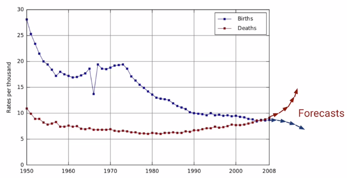

### Imputation (Fill gaps)

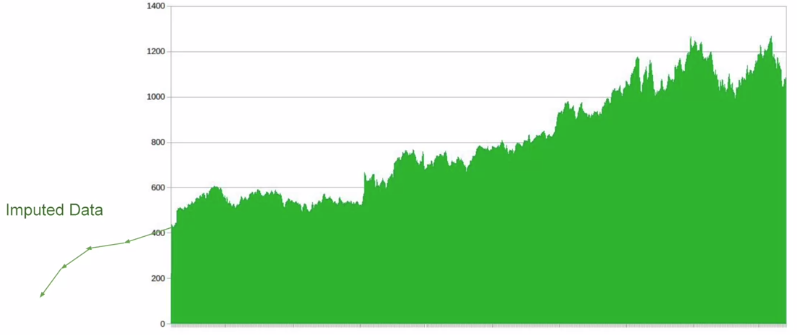
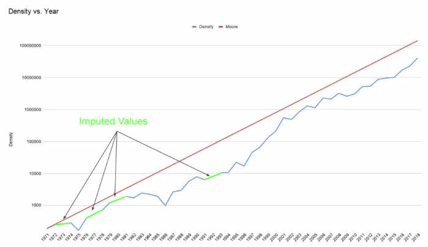

### Anomalies Detection

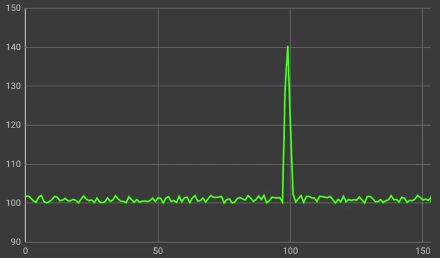

### Pattern Analysis

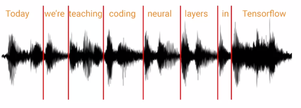

## Common Patterns in Time Series

這周先排除任何 machine learning，從 time series 的基礎，以及統計的角度來學習

Time series 有四種常見的 patterns，這些 patterns 也可能組合在一起

1. Trend
2. Seasonality
3. Noise
4. Autocorreletion

每一種 time series 都可以人造產生，這邊有一個範例的 [notebook](https://colab.research.google.com/github/lmoroney/dlaicourse/blob/master/TensorFlow%20In%20Practice/Course%204%20-%20S%2BP/S%2BP_Week_1_Lesson_2.ipynb)

``` python
def plot_series(time, series, format="-", start=0, end=None, label=None):
   plt.plot(time[start:end], series[start:end], format, label=label)
   plt.xlabel("Time")
   plt.ylabel("Value")
   if label:
      plt.legend(fontsize=14)
   plt.grid(True)
```

### Trend

Time series 呈現一種上升或下降的趨勢

``` python
def trend(time, slope=0):
    return slope * time

time = np.arange(4 * 365 + 1)
series = trend(time, 0.1)

plt.figure(figsize=(10, 6))
plot_series(time, series)
plt.show()
```

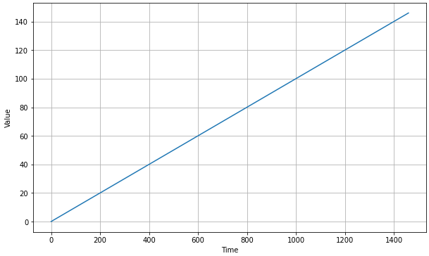

### Seasonality

Time series 反覆出現同一種樣式，可能在特定時間特別高

``` python
def seasonal_pattern(season_time):
   """Just an arbitrary pattern, you can change it if you wish"""
   return np.where(season_time < 0.4,
                  np.cos(season_time * 2 * np.pi),
                  1 / np.exp(3 * season_time))

def seasonality(time, period, amplitude=1, phase=0):
   """Repeats the same pattern at each period"""
   season_time = ((time + phase) % period) / period
   return amplitude * seasonal_pattern(season_time)

amplitude = 40
series = seasonality(time, period=365, amplitude=amplitude)

plt.figure(figsize=(10, 6))
plot_series(time, series)
plt.show()
```

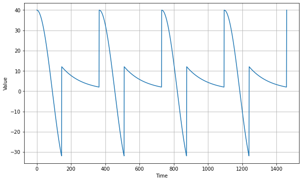

### Noise

Time series 呈現隨機狀態

``` python
def white_noise(time, noise_level=1, seed=None):
   rnd = np.random.RandomState(seed)
   return rnd.randn(len(time)) * noise_level

noise_level = 5
noise = white_noise(time, noise_level, seed=42)

plt.figure(figsize=(10, 6))
plot_series(time, noise)
plt.show()
```

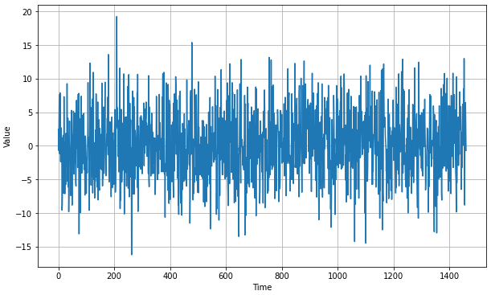

### Autocorreletion

Time series 的尖峰是隨機突起的，但隨後會有規律的衰退 (decay)

例如下圖的 time series 可以用公式表達成: 

$$
v(t) = 0.99 \times v(t-1) + \text{occasional spike}
$$

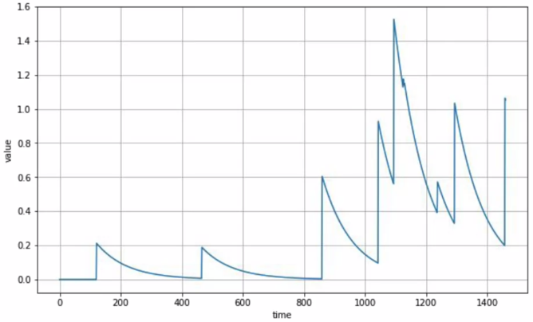

另外一個例子:

``` python
def autocorrelation(time, amplitude, seed=None):
   rnd = np.random.RandomState(seed)
   φ1 = 0.5
   φ2 = -0.1
   ar = rnd.randn(len(time) + 50)
   ar[:50] = 100
   for step in range(50, len(time) + 50):
      ar[step] += φ1 * ar[step - 50]
      ar[step] += φ2 * ar[step - 33]
   return ar[50:] * amplitude

series = autocorrelation(time, 10, seed=42)
plot_series(time[:200], series[:200])
plt.show()
```
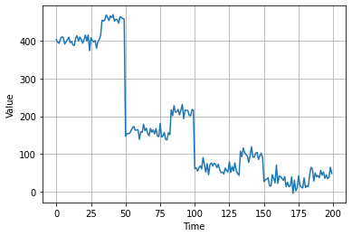

### Combinations

以上四種 pattern 可能會同時一起出現:

``` python
series = autocorrelation(time, 10, seed=42) + seasonality(time, period=50, amplitude=150) + trend(time, 2) + noise
plot_series(time[:200], series[:200])
plt.show()
```

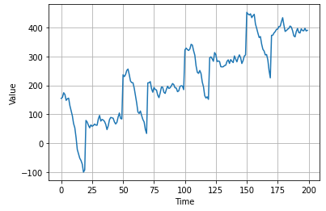

### Non-stationary Time Series

Time series 不一定永遠都會照著預測前進，可能遇到突發事件產生重大變化

這種 time series 稱為 `non-stationary time series`

``` python
series = autocorrelation(time, 10, seed=42) + seasonality(time, period=50, amplitude=150) + trend(time, 2)
series2 = autocorrelation(time, 5, seed=42) + seasonality(time, period=50, amplitude=2) + trend(time, -1) + 550
series[200:] = series2[200:]
plot_series(time[:300], series[:300])
plt.show()
```

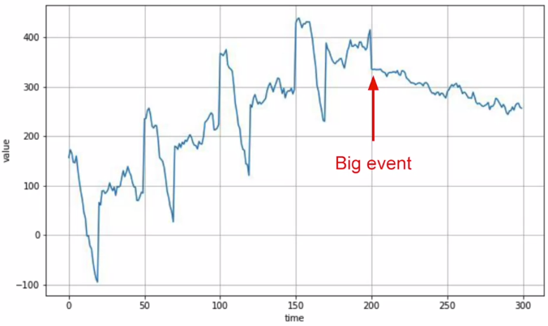

## Train, Validation, Test sets

在利用統計學預測 time series 之前，一樣要將 time series 拆成 train/val/test

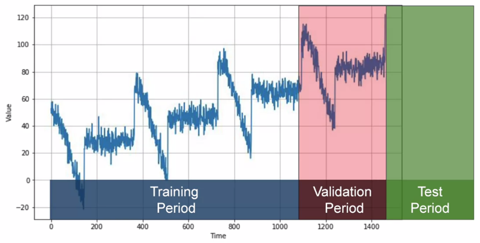

通常會訓練 training data 然後再使用 validation 測試

再把 validation 丟進來訓練，用未來的結果當作 test

``` python
split_time = 1000
time_train = time[:split_time]
x_train = series[:split_time]
time_valid = time[split_time:]
x_valid = series[split_time:]

plt.figure(figsize=(10, 6))
plot_series(time_train, x_train)
plt.show()

plt.figure(figsize=(10, 6))
plot_series(time_valid, x_valid)
plt.show()
```

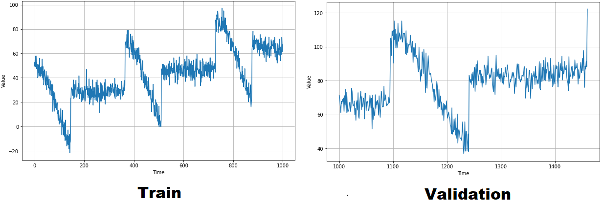

## Forecasting

預測 time series 的第一個方法叫做 `Naive Forecasting`

簡單來說，就是拿當下的值來預測下一個時間點的值，這可以做為我們的 baseline

``` python

```

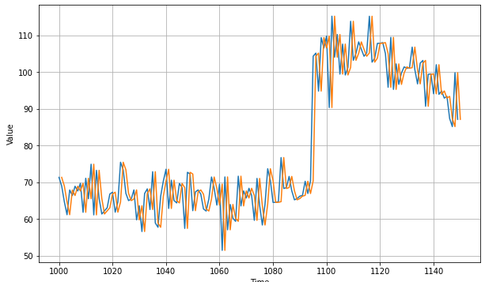

我們會用以下幾種方法計算 loss

``` python
1. errors = forecast - actual
2. mse    = np.square(errors).mean()
3. rmse   = np.sqrt(mse)
4. mae    = np.abs(errors).mean()
5. mape   = np.abs(errors / x_valid).mean()
```

* 若大的 error 影響很大: 用 mse
* 其他: 可以用 mae

Naive forecasting 的兩個 error 分別為:

``` python
print(keras.metrics.mean_squared_error(x_valid, naive_forecast).numpy())
print(keras.metrics.mean_absolute_error(x_valid, naive_forecast).numpy())

# 61.827538
# 5.9379086
```

接下來會嘗試用幾種統計方法預測 time series 作為之後 ML 能否打敗的 baseline

### Moving Average

Moving average 的每個 step 預測會抓出前 **n 個時間點 (window size)** 的平均值當作預測值

``` python
def moving_average_forecast(series, window_size):
   """Forecasts the mean of the last few values.
      If window_size=1, then this is equivalent to naive forecast"""
   forecast = []
   for time in range(len(series) - window_size):
      forecast.append(series[time:time + window_size].mean())
   return np.array(forecast)

moving_avg = moving_average_forecast(series, 30)[split_time - 30:]

plt.figure(figsize=(10, 6))
plot_series(time_valid, x_valid)
plot_series(time_valid, moving_avg)
```

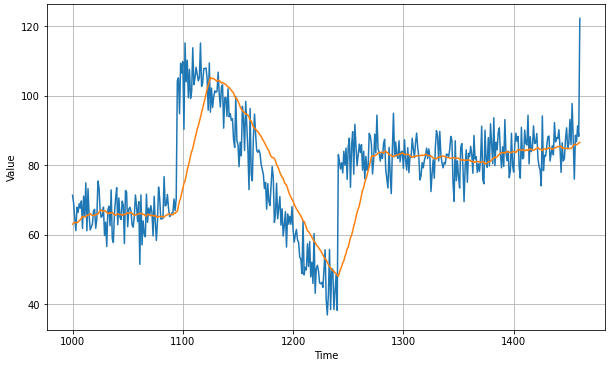

Moving average 的 error 分別為:

``` python
print(keras.metrics.mean_squared_error(x_valid, moving_avg).numpy())
print(keras.metrics.mean_absolute_error(x_valid, moving_avg).numpy())

# 106.674576
# 7.142419
```

用 30 天的 moving average 預測結果比 naive forecasting 還差 !

### Differencing

Moving average 掌握不到 trend 和 seasonality

所以我們用 differencing 減去當前時間和 365 天前的差異 (因為 seasonality 剛好是 365 天周期) 

接著再從中找出 differencing 的 moving average!

``` python
diff_series = (series[365:] - series[:-365])
diff_time = time[365:]

diff_moving_avg = moving_average_forecast(diff_series, 50)[split_time - 365 - 50:]

plt.figure(figsize=(10, 6))
plot_series(time_valid, diff_series[split_time - 365:])
plot_series(time_valid, diff_moving_avg)
plt.show()
```

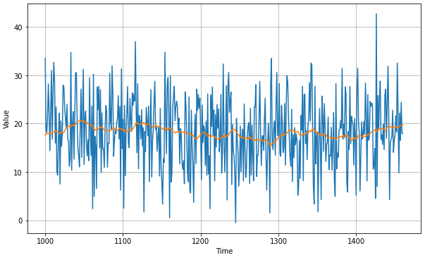

接著再把這個結果加回原本的 raw time series

``` python
diff_moving_avg_plus_past = series[split_time - 365:-365] + diff_moving_avg

plt.figure(figsize=(10, 6))
plot_series(time_valid, x_valid)
plot_series(time_valid, diff_moving_avg_plus_past)
plt.show()
```

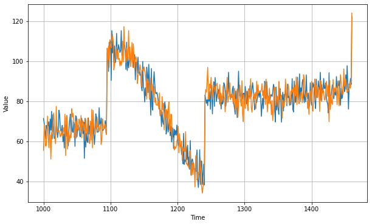

``` python
print(keras.metrics.mean_squared_error(x_valid, diff_moving_avg_plus_past).numpy())
print(keras.metrics.mean_absolute_error(x_valid, diff_moving_avg_plus_past).numpy())

# 52.973656
# 5.8393106
```

效果比 naive forecasting 還要好了，但還可以再更好

方法是把 `diff_moving_avg` 和原本的 moving average 加在一起，而非 raw time series

``` python
diff_moving_avg_plus_smooth_past = moving_average_forecast(series[split_time - 370:-360], 10) + diff_moving_avg

plt.figure(figsize=(10, 6))
plot_series(time_valid, x_valid)
plot_series(time_valid, diff_moving_avg_plus_smooth_past)
plt.show()
```

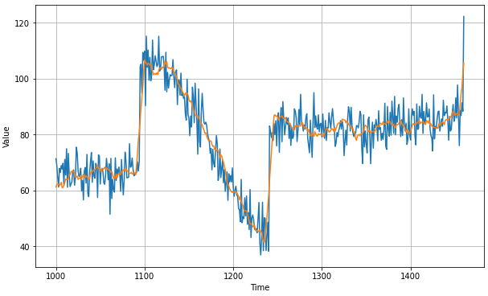

``` python
print(keras.metrics.mean_squared_error(x_valid, diff_moving_avg_plus_smooth_past).numpy())
print(keras.metrics.mean_absolute_error(x_valid, diff_moving_avg_plus_smooth_past).numpy())

# 33.45226
# 4.569442
```

# Exercise

Exercise 1 很簡單，就是把上面各種 forecasting 方式全部重做一遍

1. Train/val/test split
2. Naive forecasting
3. Moving average
4. Differencing
5. Moving average + differencing

[Exercise 1 的解答在這裡](exercise1.ipynb)