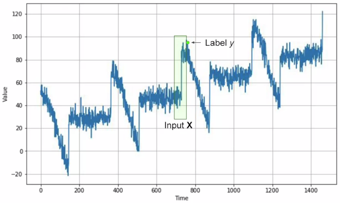
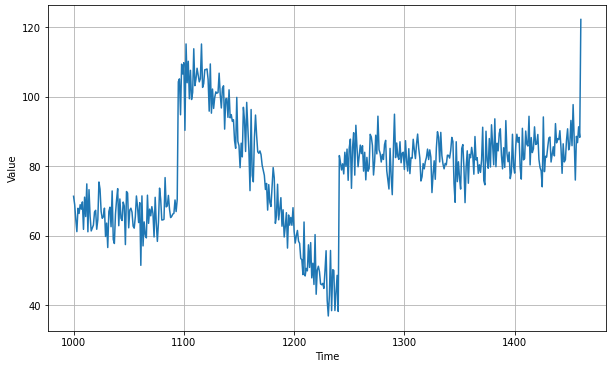
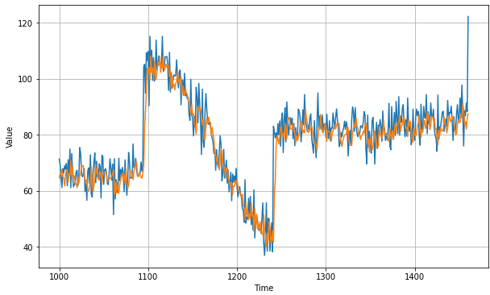
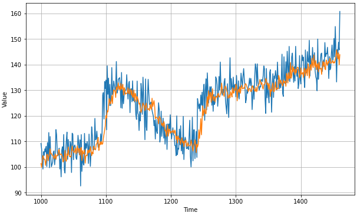
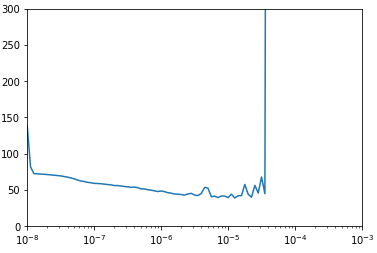
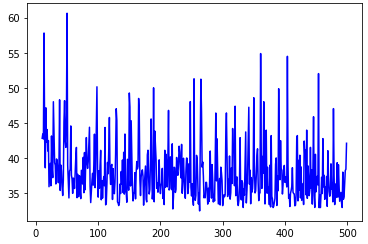
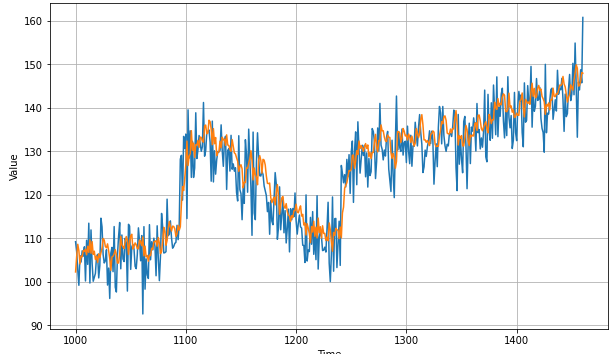

# Deep Neural Networks for Time Series

這周將使用機器學習中簡單的 DNN 來訓練預測 time series，以及使用一些技巧自動化 tuning hyperparameters 的地方

## Preparing features and labels



要建立資料集，方法是將 window 裡的每個值作為 `feature`，而 window 的下一個值作為 `label`

``` python
dataset = tf.data.Dataset.range(10)
for val in dataset:
   print(val.numpy())
# 0 1 2 3 4 5 6 7 8 9


dataset = dataset.window(5, shift=1, drop_remainder=True)
for window_dataset in dataset:
    for val in window_dataset:
        print(val.numpy(), end=" ")
    print()
# 0 1 2 3 4 
# 1 2 3 4 5 
# 2 3 4 5 6 
# 3 4 5 6 7 
# 4 5 6 7 8 
# 5 6 7 8 9 


dataset = dataset.flat_map(lambda window: window.batch(5))
for window in dataset:
    print(window.numpy())
# [0 1 2 3 4]
# [1 2 3 4 5]
# [2 3 4 5 6]
# [3 4 5 6 7]
# [4 5 6 7 8]
# [5 6 7 8 9]


dataset = dataset.map(lambda window: (window[:-1], window[-1:]))
for x,y in dataset:
    print(x.numpy(), y.numpy())
# [0 1 2 3] [4]
# [1 2 3 4] [5]
# [2 3 4 5] [6]
# [3 4 5 6] [7]
# [4 5 6 7] [8]
# [5 6 7 8] [9]


dataset = dataset.shuffle(10)
for x,y in dataset:
    print(x.numpy(), y.numpy())
# [5 6 7 8] [9]
# [2 3 4 5] [6]
# [0 1 2 3] [4]
# [4 5 6 7] [8]
# [1 2 3 4] [5]
# [3 4 5 6] [7]


dataset = dataset.batch(2).prefetch(1)
for x,y in dataset:
  print("x = ", x.numpy())
  print("y = ", y.numpy())

# x =  [[4 5 6 7] [1 2 3 4]]
# y =  [[8] [5]]
# x =  [[0 1 2 3] [2 3 4 5]]
# y =  [[4] [6]]
# x =  [[5 6 7 8] [3 4 5 6]]
# y =  [[9] [7]]
```

上面用到的所有 `tf.data.Dataset` 技巧都可以在 [官方文件](https://www.tensorflow.org/api_docs/python/tf/data/Dataset) 查看

1. `tf.data.Dataset.range()` 可以創建 sequence data
2. `dataset.window()` 可以將 sequence data 用移動 window 方式擷取出資料
   1. `drop_remainder` 將小於 `window_size` 的資料群丟掉
3. `dataset.flat_map(map_func)` 將資料先透過 `map_func` 修改，再對資料 flatten
4. `dataset.map()` 把每個資料切成 feature 和 label
5. `dataset.shuffle(buffer_size)` 把資料洗牌
   1. 會 random 從一個大小為 `buffer_size` 的 buffer 中抓資料
   2. 要完美的洗牌資料，要定義 `buffer_size` 大於等於 dataset 大小
6. `dataset.batch(x)` 把資料拆成大小為 x 的 batches
   1. `prefetch` 可以預先載入，加速分裝

> * 為什麼要 shuffle 資料 ?
> * 因為要避免 `Sequence bias`
> * e.g. 請問你最喜歡的電視節目是什麼 ? "Game of Thrones", "Killing Eve", "Travellers" and "Doctor Who" ?
> * 你很有可能選擇 `Game of Thrones` 因為他不但最熟悉、而且在問句的最前面，但其實四個節目都是一樣權重的



現在就可以把任一個 series 放到上面的 `Dataset` 處理步驟，產生新的 dataset

``` python
split_time = 1000
time_train = time[:split_time]
x_train = series[:split_time]
time_valid = time[split_time:]
x_valid = series[split_time:]

window_size = 20
batch_size = 32
shuffle_buffer_size = 1000

def windowed_dataset(series, window_size, batch_size, shuffle_buffer):
    dataset = tf.data.Dataset.from_tensor_slices(series)
    dataset = dataset.window(window_size + 1, shift=1, drop_remainder=True)
    dataset = dataset.flat_map(lambda window: window.batch(window_size + 1))
    dataset = dataset.shuffle(shuffle_buffer).map(lambda window: (window[:-1], window[-1]))
    dataset = dataset.batch(batch_size).prefetch(1)
    return dataset

dataset = windowed_dataset(x_train, window_size, batch_size, shuffle_buffer_size)
```

## Single layer neural network

首先先用單個 neuron 來訓練 regression 預測 window 的下一個值是多少

``` python
l0 = tf.keras.layers.Dense(1, input_shape=[window_size])
model = tf.keras.models.Sequential([l0])

model.compile(loss="mse", optimizer=tf.keras.optimizers.SGD(lr=1e-6, momentum=0.9))
model.fit(dataset, epochs=100, verbose=0)

print("Layer weights {}".format(l0.get_weights()))
```

我們用 `get_weights` 可以得出最後一層最後的權重 ($$w_{t0}, w_{t1}, \cdots, w_{t19}$$) 還有一個 bias ($$b$$)

``` python
# Layer weights [array([[-0.02798022],
#        [-0.05253613],
#        [ 0.02511223],
#        [ 0.05521895],
#        [ 0.02071053],
#        [-0.00524058],
#        [-0.06855132],
#        [ 0.06445912],
#        [ 0.01648564],
#        [ 0.02554734],
#        [-0.12104012],
#        [ 0.00803768],
#        [ 0.03987362],
#        [ 0.0728454 ],
#        [-0.05691422],
#        [-0.01854816],
#        [ 0.10617048],
#        [ 0.28391498],
#        [ 0.21554975],
#        [ 0.39646825]], dtype=float32), array([0.01939926], dtype=float32)]
```

代表 window 中的 20 個值會和各權重相乘，最後加上 bias 就得到預測值

預測方法很簡單，對 series 上每 20 (window_size) 個值進行預測即可

``` python
forecast = []

for time in range(len(series) - window_size):
    forecast.append(model.predict(series[time:time + window_size][np.newaxis]))

# Get valid part
forecast = forecast[split_time-window_size:]
results = np.array(forecast)[:, 0, 0]

plt.figure(figsize=(10, 6))

plot_series(time_valid, x_valid)
plot_series(time_valid, results)
```



``` python
tf.keras.metrics.mean_absolute_error(x_valid, results).numpy()
# 5.051666
```

## Deep neural network

試著進步到三層的神經網路看看效果如何

``` python
dataset = windowed_dataset(x_train, window_size, batch_size, shuffle_buffer_size)

model = tf.keras.models.Sequential([
    tf.keras.layers.Dense(10, input_shape=[window_size], activation="relu"), 
    tf.keras.layers.Dense(10, activation="relu"), 
    tf.keras.layers.Dense(1)
])

model.compile(loss="mse", optimizer=tf.keras.optimizers.SGD(lr=1e-6, momentum=0.9))
model.fit(dataset,epochs=100,verbose=0)

forecast = []
for time in range(len(series) - window_size):
  forecast.append(model.predict(series[time:time + window_size][np.newaxis]))

forecast = forecast[split_time-window_size:]
results = np.array(forecast)[:, 0, 0]


plt.figure(figsize=(10, 6))

plot_series(time_valid, x_valid)
plot_series(time_valid, results)
```



``` python
tf.keras.metrics.mean_absolute_error(x_valid, results).numpy()
# 4.7252703
```

上面有一個地方可以改進，就是 optimizer SGD 中的 `learning rate (1e-6)` 可能不是最好的參數

我們可以自動化去找尋最優的參數，定義一個 `tf.keras.callbacks.LearningRateScheduler()`

這個 callback 放在 `model.fit()` 裡面，會根據 epoch 的不同而改變 learning rate

最後我們再把所有 lr 的結果一起比對，挑出最好的 lr

``` python
lr_schedule = tf.keras.callbacks.LearningRateScheduler(
    lambda epoch: 1e-8 * 10**(epoch / 20))

optimizer = tf.keras.optimizers.SGD(lr=1e-8, momentum=0.9)
model.compile(loss="mse", optimizer=optimizer)
history = model.fit(dataset, epochs=100, callbacks=[lr_schedule], verbose=0)

# Print out the performance with different lr
lrs = 1e-8 * (10 ** (np.arange(100) / 20))
plt.semilogx(lrs, history.history["loss"])
plt.axis([1e-8, 1e-3, 0, 300])
```



在上面每 20 個 epoch 就會增加 lr 的大小，從 `1e-8` 到 `1e-4`

| epochs | lr   |
| ------ | ---- |
| 0-19   | 1e-8 |
| 20-39  | 1e-7 |
| 40-59  | 1e-6 |
| 60-79  | 1e-5 |
| 80-99  | 1e-4 |

我們就可以選出最穩定且 loss 最小的 lr 重新訓練一次，在上圖差不多是 `1e-5` 的 lr 最好

``` python
optimizer = tf.keras.optimizers.SGD(lr=1e-5, momentum=0.9)
model.compile(loss="mse", optimizer=optimizer)
history = model.fit(dataset, epochs=500, verbose=0)

loss = history.history['loss']
epochs = range(10, len(loss))
plt.plot(epochs, loss[10:], 'b', label='Training Loss')
plt.show()
```

因為 10 epoch 急速下降，所以我們只 plot 10 epoch 後的結果



結果如下: 



# Exercise

再 exercise 2 要試著自己合成 time series，然後自己用 DNN 來訓練 model 來預測這個 series

[Exercise 2 的解答在這裡](exercise2.ipynb)