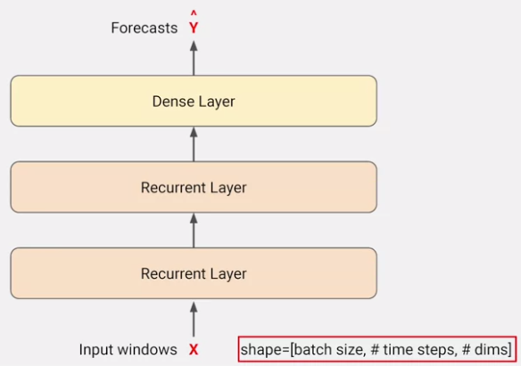
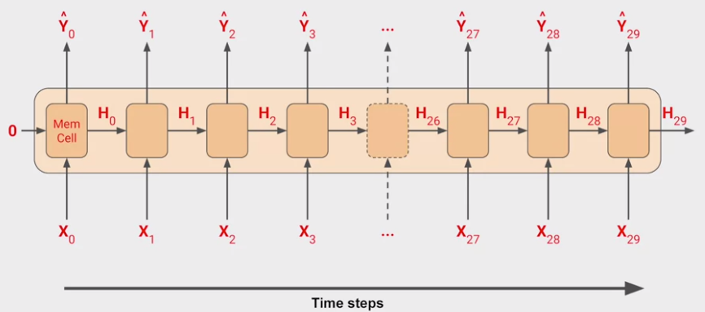
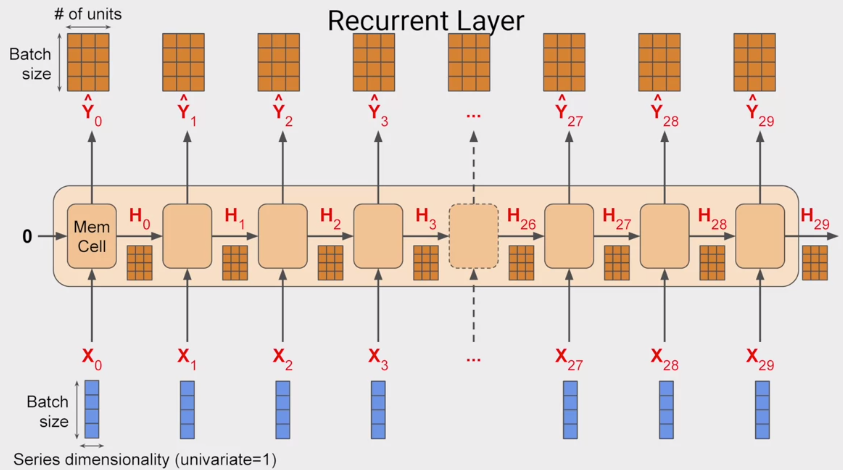
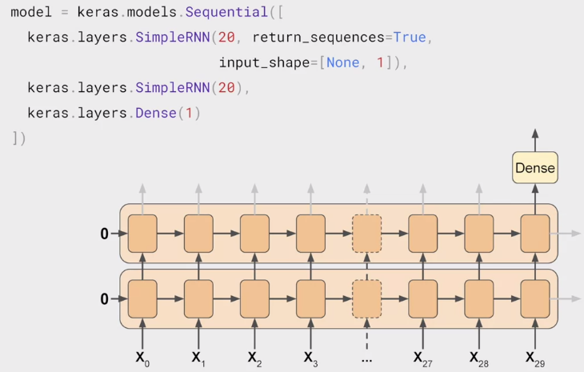
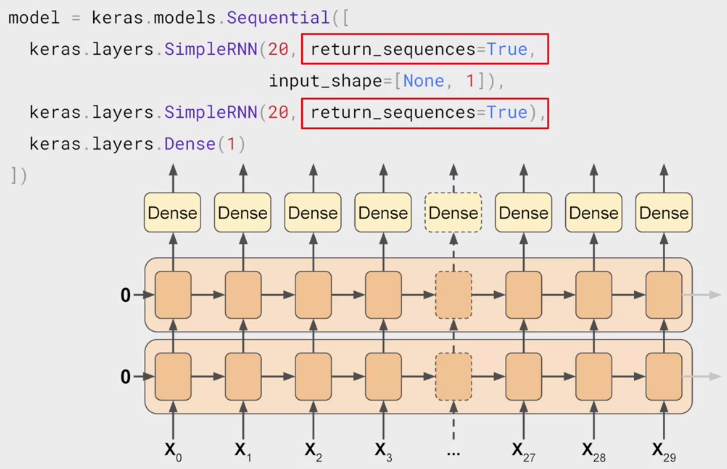
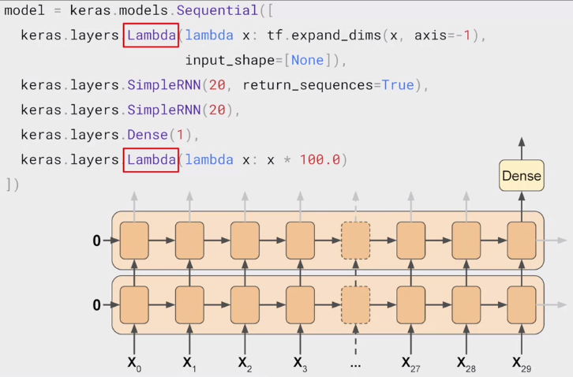

# Recurrent Neural Networks for Time Series

Time series 這種 sequence data 很明顯就要用 RNN 之類的模型來處理呀! 所以這周將使用 RNN, LSTM 來訓練 time series

另外，我們會學到再模型中加入 **lambda layers**，可以更自由的控制模型的某一層構造和功能

## Conceptual Overview



這次的模型是將一整個 batch 的 series 餵進兩個 RNN 和一個 Dense 然後吐出一整個 batch 的 forecasts

* Input shape 將會是三維的，分別是
  1. batch size
  2. time steps
  3. 每個 time step 的 dimension
     * univariate then = 1
     * multivariate then > 1

### RNN detail



RNN 實際是不斷在同一個 cell 重複運作，但可以把他想像成攤開的樣子

假設 window size 為 30 那麼當 30 個 y 都被預測完畢後，就可以回傳

### Shape of the inputs

現在假設 batch size 為 4，那麼整個 input shape 就會是 `(4, 30, 1)`



1. 每個 time step 會是一個 (4, 1) 的形狀
2. 如果 cell neuron 是 3 個，那麼每個 `y` 的輸出就會是 (4, 3) 的形狀
3. 通常餵給下一個 time step 的 `H` 會和 `y` 一樣

Tensorflow 的預設輸出是 **Sequence-to-Vector** 也就是輸出最後一個 y 的結果，但也可以輸出所有 y 的結果，叫做 **Sequence-to-Sequence** (只要更改 `return_sequences` 就行)

``` python
...
tf.keras.layers.SimpleRNN(40, return_sequences=True),
...
```

### Outputting a sequence

下面就是一個 **Sequence-to-Vector** 的範例，可以注意的是 `input_shape`

* 第一個參數是 batch_size，給 `None` 代表任意大小都可以
* 第二個參數是 number_of_time_steps


下面是另一個 **Sequence-to-Sequence** 的範例



### Lambda Layer

Lambda layer 可以加入一個 layer 對資料實現任何的 lambda function



1. 第一個 lambda 對資料增加一個維度
   1. 因為 window helper function 只會給我們 (batch_size, time_step) 的格式
   2. 但 RNN 需要三個維度，就是 time step 的 dimension
   3. 這邊的 `input_shape=[None]` 代表可以處理任意長度的 sequences
2. 第二個 lambda 放大 output 的 scale
   1. 因為 output 為 tanh (-1 至 1)
   2. 但 time series 通常落於 40, 50, 60, 70 等

### Huber Loss

這次用的 loss function 叫作 Huber Loss，他會忽略一些 outliers 幫助我們對抗 noise

``` python
model.compile(loss=tf.keras.losses.Huber(),
              optimizer=optimizer,
              metrics=["mae"])
```

詳細的 Huber loss 介紹可以參考: https://en.wikipedia.org/wiki/Huber_loss

整個 RNN forecasting 的過程可以到 [notebook](https://colab.research.google.com/github/lmoroney/dlaicourse/blob/master/TensorFlow%20In%20Practice/Course%204%20-%20S%2BP/S%2BP%20Week%203%20Lesson%202%20-%20RNN.ipynb) 查看

## LSTMs

RNN 雖然可以傳遞關聯性，但很容易隨著時間消逝，這時就可以使用 LSTM 看看


可以到這邊查看 [LSTM 的詳細課程](https://www.coursera.org/lecture/nlp-sequence-models/long-short-term-memory-lstm-KXoay)

### Coding LSTM

我們嘗試用 1, 2, 3 層的 Bi-LSTM 來試試看效果，並用 `tf.keras.backend.clear_session()` 來避免 model 之間有參數互相衝突

詳細的 `clear_session()` 資訊可以到這邊看 [官方文件](https://www.tensorflow.org/api_docs/python/tf/keras/backend/clear_session)

``` python
tf.keras.backend.clear_session()

dataset = windowed_dataset(x_train, window_size, batch_size, shuffle_buffer_size)

model = tf.keras.models.Sequential([
  tf.keras.layers.Lambda(lambda x: tf.expand_dims(x, axis=-1),
                      input_shape=[None]),
  tf.keras.layers.Bidirectional(tf.keras.layers.LSTM(32, return_sequences=True)),
  tf.keras.layers.Bidirectional(tf.keras.layers.LSTM(32, return_sequences=True)),
  tf.keras.layers.Bidirectional(tf.keras.layers.LSTM(32)),
  tf.keras.layers.Dense(1),
  tf.keras.layers.Lambda(lambda x: x * 100.0)
])


model.compile(loss="mse", optimizer=tf.keras.optimizers.SGD(lr=1e-6, momentum=0.9))
model.fit(dataset,epochs=100)
```

完整的程式碼可以到 [notebook](https://colab.research.google.com/github/lmoroney/dlaicourse/blob/master/TensorFlow%20In%20Practice/Course%204%20-%20S%2BP/S%2BP%20Week%203%20Lesson%204%20-%20LSTM.ipynb) 查看

# Exercise

在 exercise 3 就是複習所學的東西，包括 RNN, LSTM, LearningRateScheduler

[Exercise 3 的解答在這裡](exercise3.ipynb)